Тай Тай (Taytay) - бывшая столица Палавана. Во время нашего путешествия по Филиппинам мы охотились за неизведанными и непопулярными местами среди туристов, пока наконец на нашли целых два.

<!--more-->

Первое из них - Сан Висенте, о котором мы подробно рассказали [тут](https://vodpop.ru/palavan-foto/ "Неизведанный Палаван: Сан Висенте") и [тут](https://vodpop.ru/gde-ostanovitsa-v-san-vincente/ "Где остановиться в Сан Винсенте на Палаване: 10 лучших мест"). А вторым открытием для нас стал Тай Тай, в котором мы неожиданно для себя остались на 8 дней.

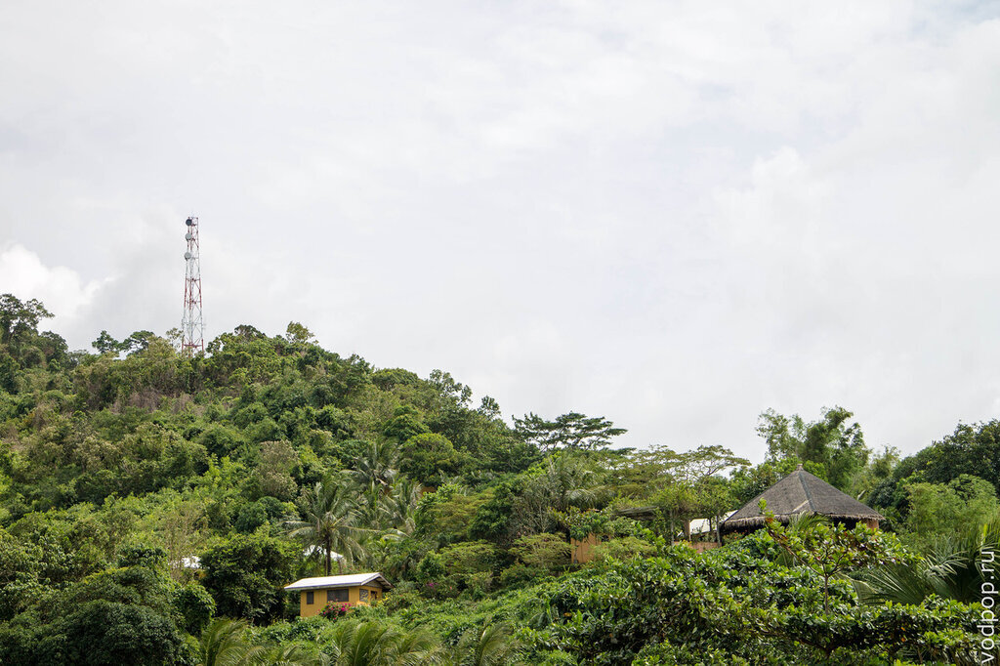

[Тай Тай](https://vodpop.ru/okrestnosti-tai-tai/ "Изучаем окрестности Тай Тай") \- довольно старый город, основанный еще во времена испанской колонизации  в 1623 году. Одна из самых популярных достопримечательностей в этом городе - Форт де Санта Изабел (Fort de Santa Isabel).

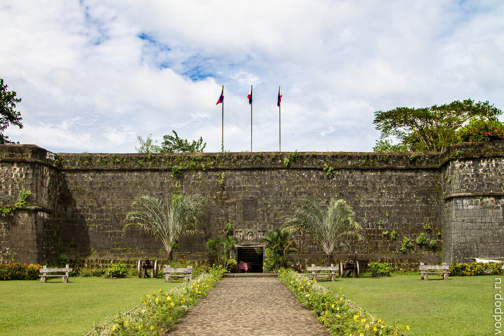

Это единственный объект, построенный исключительно человеческими усилиями , который не только сохранил первоначальный вид, но и по сей день используется в качестве места для проведения важных городских событий. Форт был полностью спроектирован испанцами, которые решили построить его прямо на берегу моря. Первоначально он был построен из дерева, но затем было принято решение перестроить его из более прочного материала. Для этого в качестве строительного материала использовали кораллы, которые тщательно обтесывались до состояния прямоугольного блока.

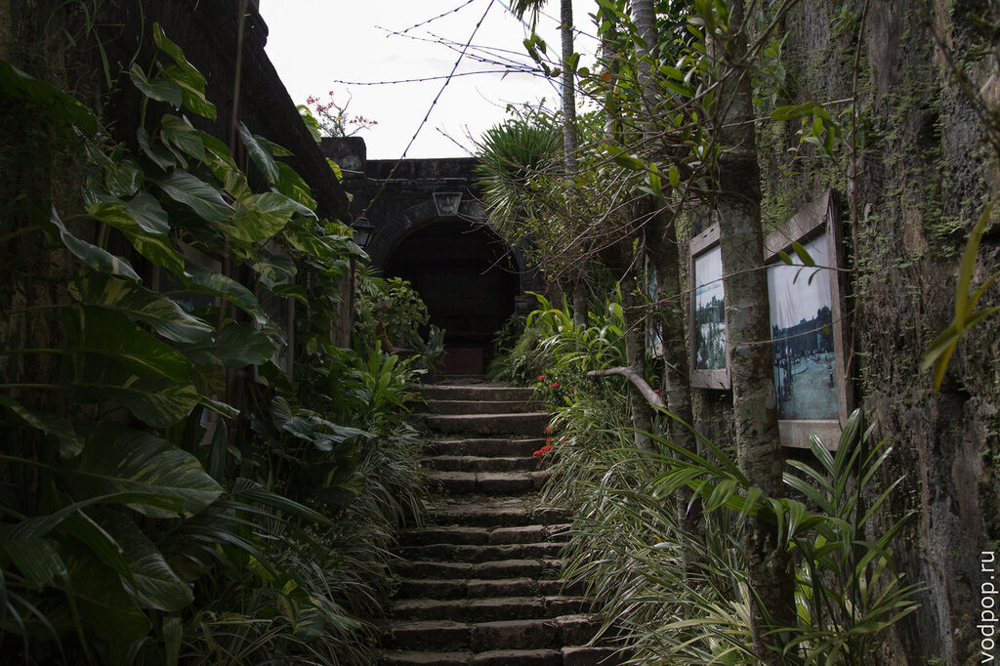

Естественно, обработкой кораллов занималось местное население. Можно только представить, сколько труда было вложено в это здание.

При входе в здание обратите внимание на высеченное на камне название и дату - строительство форта начали в 1623 году, но "современное" он получил лишь в 19 веке, в честь королевы Испании Изабеллы II.

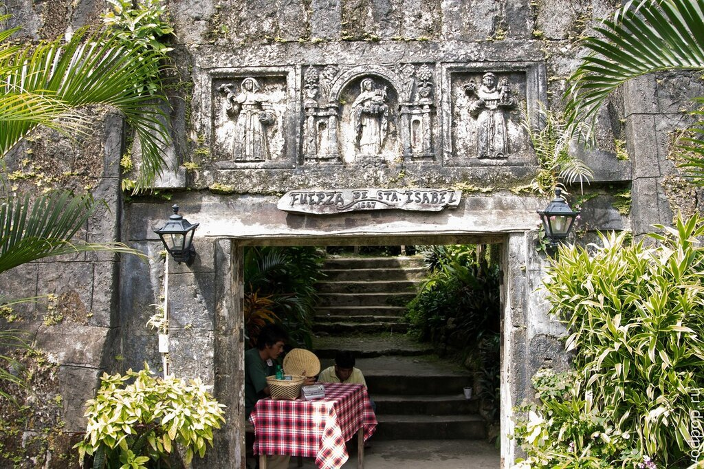

Строительство длилось 71 год, с 1667 по 17 декабря 1738 года. Завершил эту грандиозную стройку Томас Кастро, испанский военный инженер , работавший под командованием капитана Йозефа Тьерра де Сальседо. В 1700 году была завербована первая партия из 100 ссыльных филиппинцев, собранных с островов от  Лузона до Себу, чтобы помочь в строительстве форта.

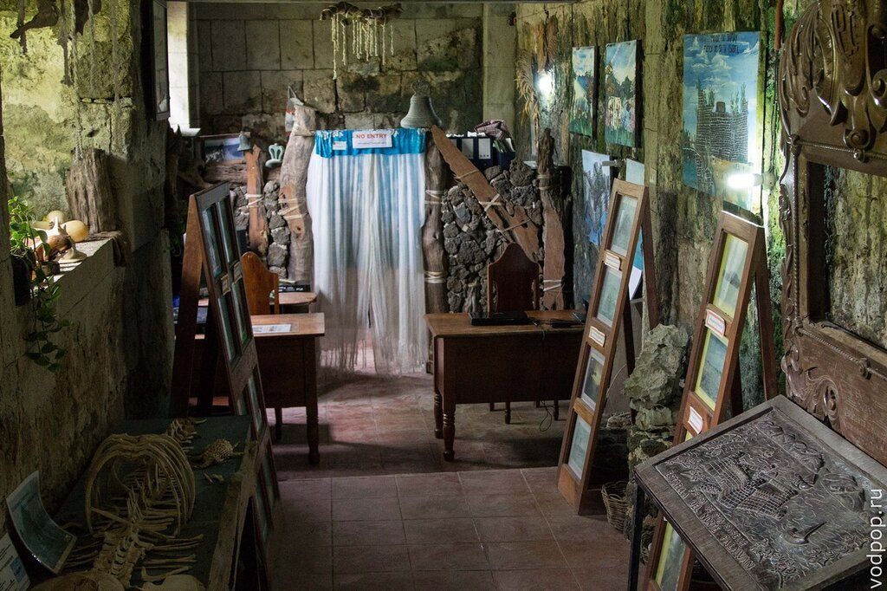

Форт был построен , чтобы защитить жителей от нападений пиратов с моря Сулу , которые лишь прятались под маской хозяев моря, а на самом деле боролись с распространением Испанской Колонизации и ростом Христианства. Испанцы несли угрозу уже сложившимся торговым отношениям между Китаем, Малайзией, Моро (иначе - Маврами; мусульманами, живущих на Филиппинах) и местным населением.

С 1730 по 1739  было послано 3800 пиратов, чтобы захватить Тай Тай, но форт стал колоссальным препятствием для всех пиратских набегов.

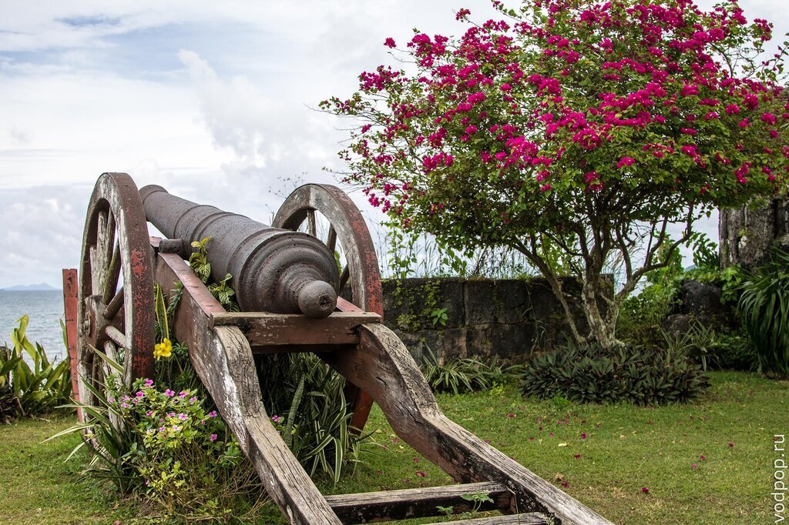

Неудивительно, что Форт де Санта Изабел является поводом для гордости каждого без исключения горожанина Тай Тая.

Правда, чтобы попасть внутрь, и местным, и туристам придется "раскошелиться" на 20 или 30 песо соответственно.

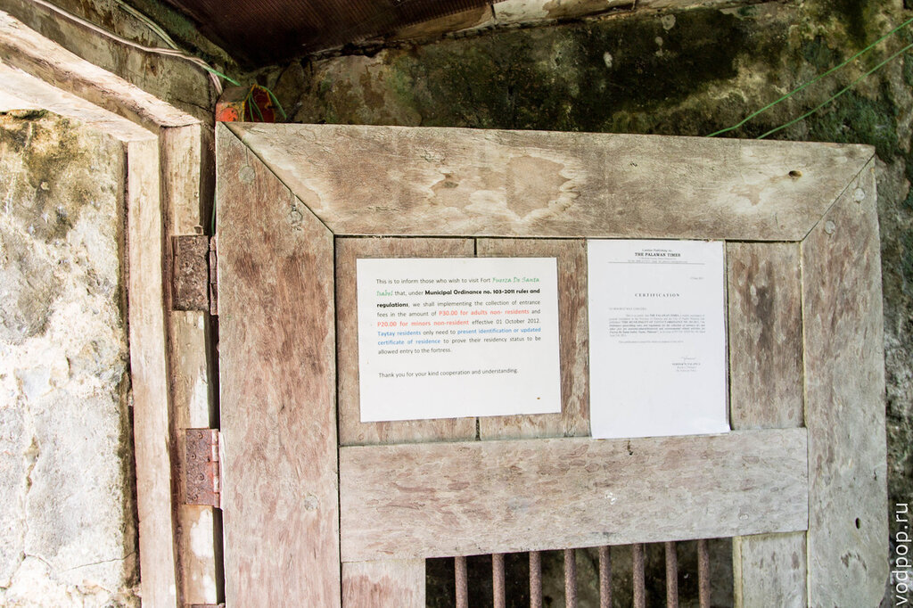

Нравится статья? Узнавайте первым о выходе новых интересных историй! Подпишитесь на нас по [эл. почте](http://feedburner.google.com/fb/a/mailverify?uri=vodpop&loc=ru_RU) или в [группе ВКонтакте](http://vk.com/vodpop)

Вписывают нас в альбом для регистрации. Наверное, статистику по странам подбивают. Русских в списке не было.

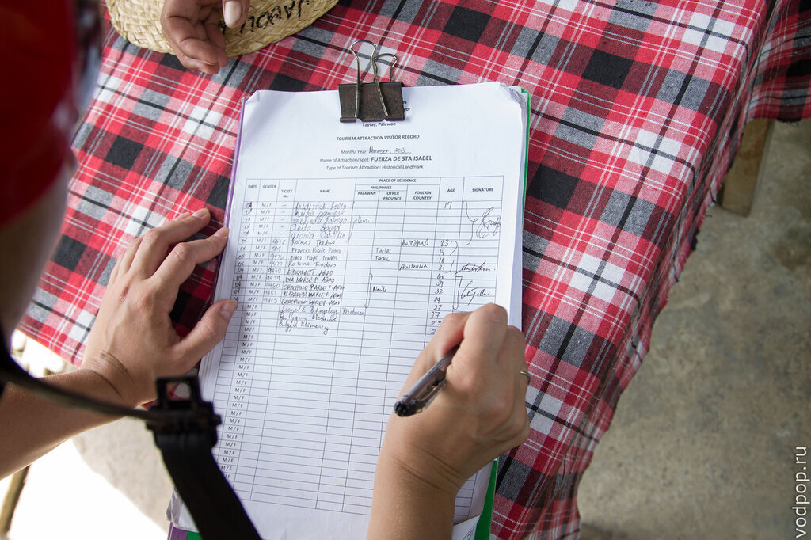

Внутри можно увидеть плакат с фотографиями и подписями самых интересных мест в округе Тай Тай.

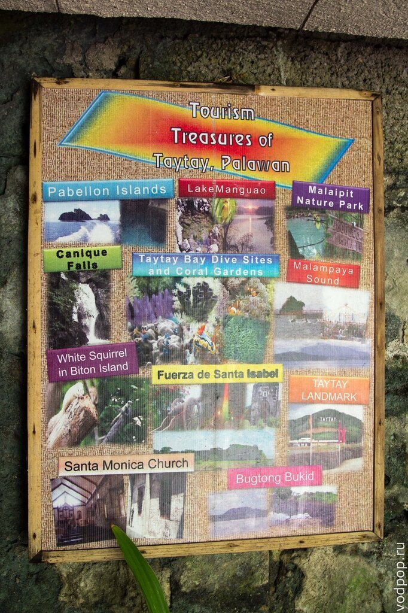

На верхней открытой площадке расположена небольшая часовня. Большинство филиппинцев - католики, весьма рьяно посещающие воскресные службы.

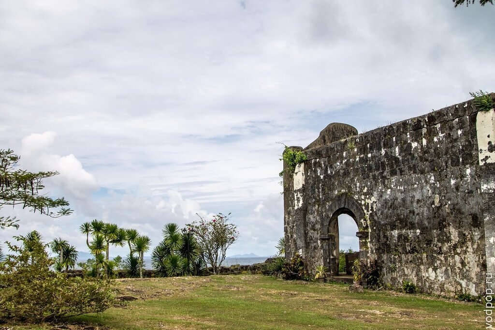

Интерьер часовни

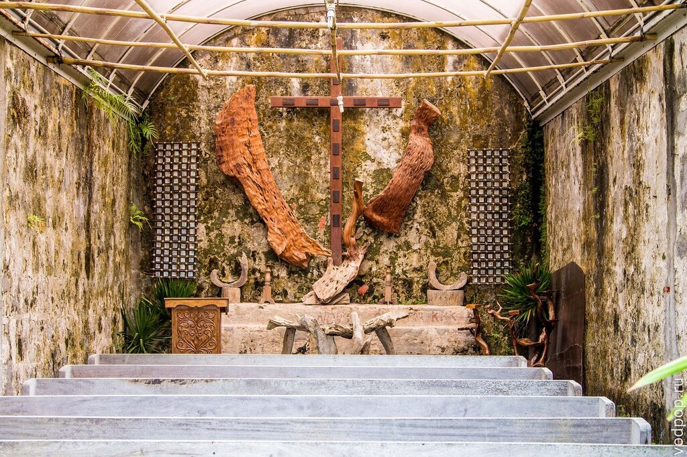

С форта видно отель, в котором мы остановились - Casa Rosa.

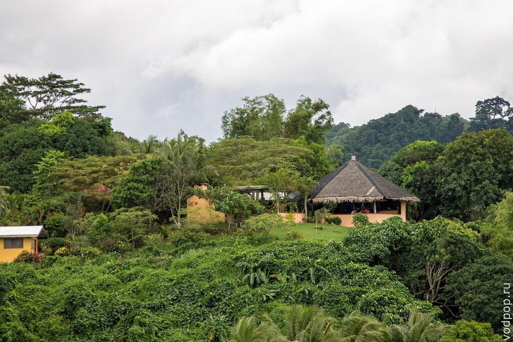

Каждый вечер мы сидели на открытой веранде и наблюдали за прекрасным видом на форт

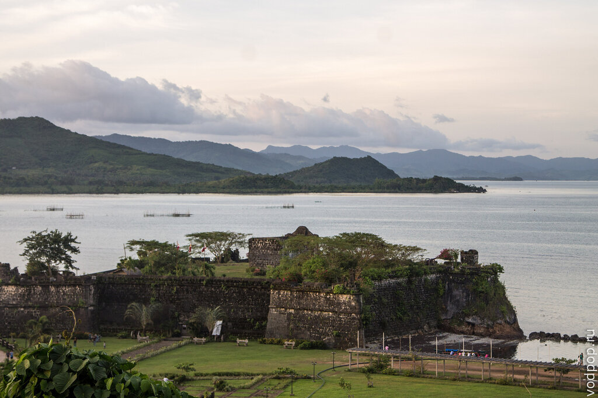

Пожалуй, еще раз повторю заглавную фотографию. Ну разве не прелесть эта надпись а-ля Голливуд?

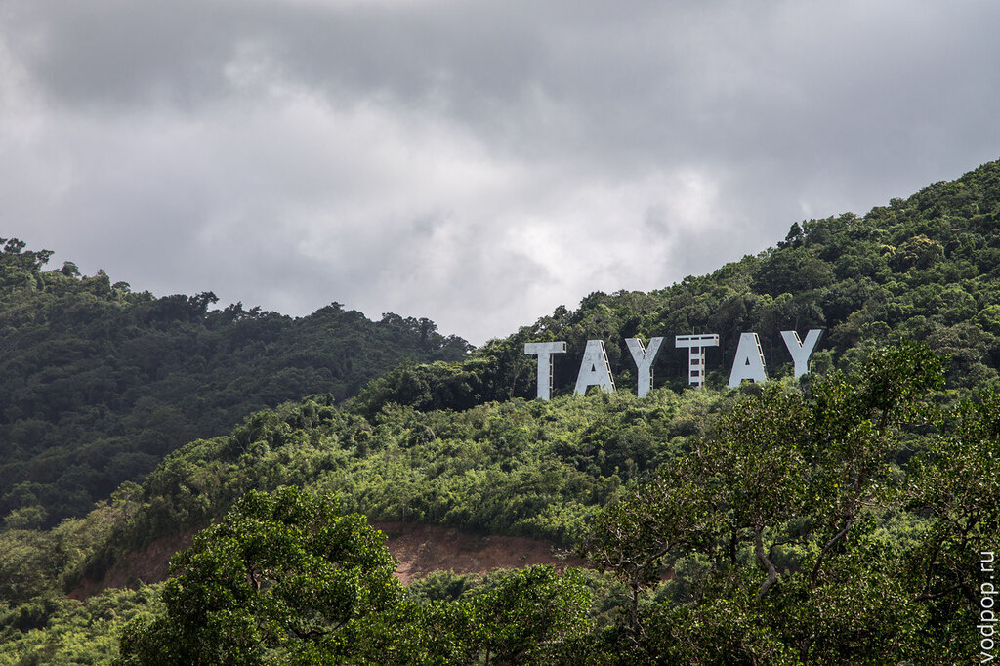

Чтобы было легче ориентироваться, приведу схематичную карту, заимствованную с сайта нашего отеля.

[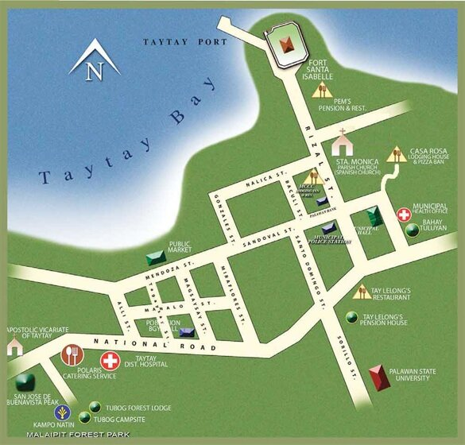](https://vodpop.ru/wp-content/uploads/2013/11/taytay-town-map.jpg)

Если соберетесь поехать туда на трайсикле, а не пешком, то запомните название, что на местном, тагальском языке, форт зовется Кута.

Увы, Тай Тай несправедливо обделен вниманием туристов. Здесь останавливаются в основном путешественники, которые ходят разбить длинный участок дороги от Пуэрто-Принцессы до [Эль Нидо](https://vodpop.ru/kak-dobratsa-do-el-nido/ "Как добраться до Эль Нидо"), но никто не приезжает целенаправленно в Тай Тай, чтобы остаться здесь не несколько ночей. И совершенно зря!

Тай Тай на карте

Помимо достопримечательностей, расположенных поблизости, из Тай Тай можно уплыть на небольшие островные отели, где цена за ночь начинается от 4000 рублей. Вы там будете совершенно одни, с трехразовым питанием, смотреть морских черепах. Чем не идеальный отпуск после тяжелых трудовых будней? Кстати, о том, как мы зарабатываем в путешествиях, можно узнать [здесь](uxman.ru).

Подробнее о достопримечательностях я расскажу в следующих статьях! Не забывайте [подписываться](http://feeds.feedburner.com/vodpop) на наш блог и [группу](http://vk.com/vodpop) в контакте.
