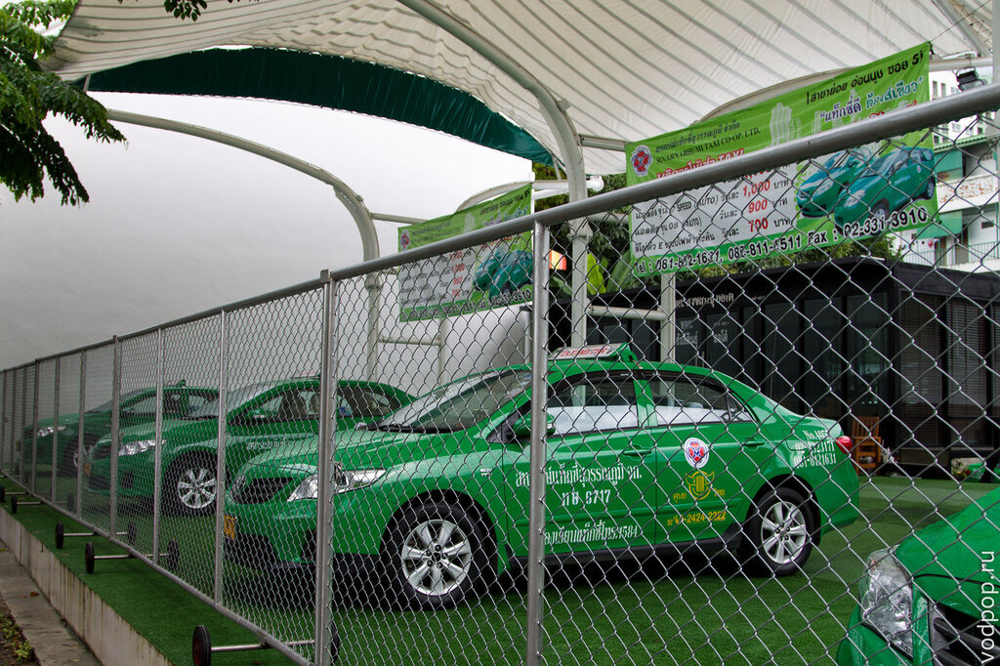
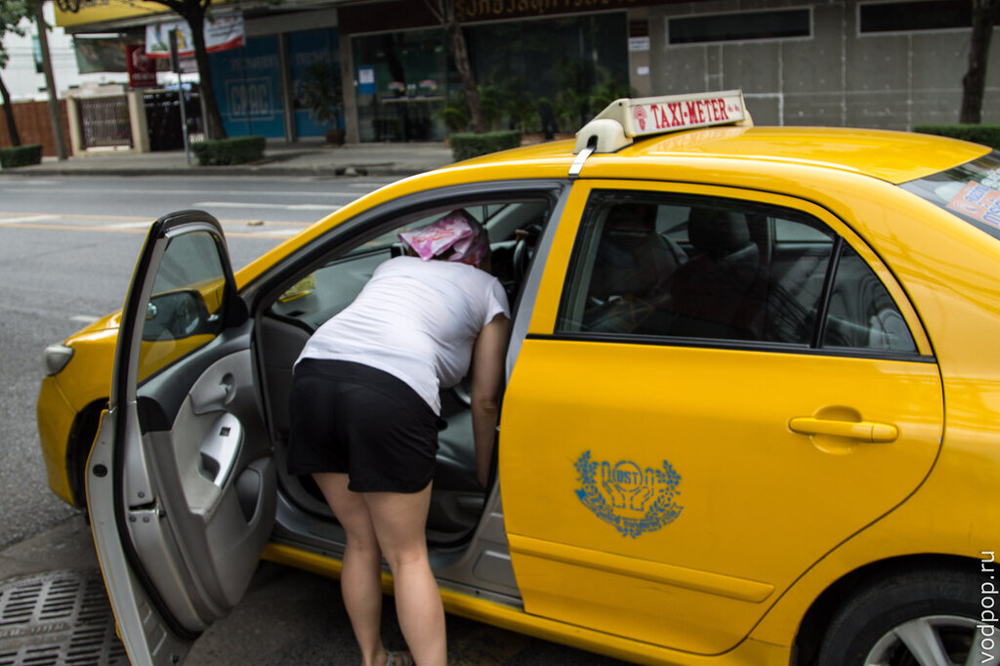
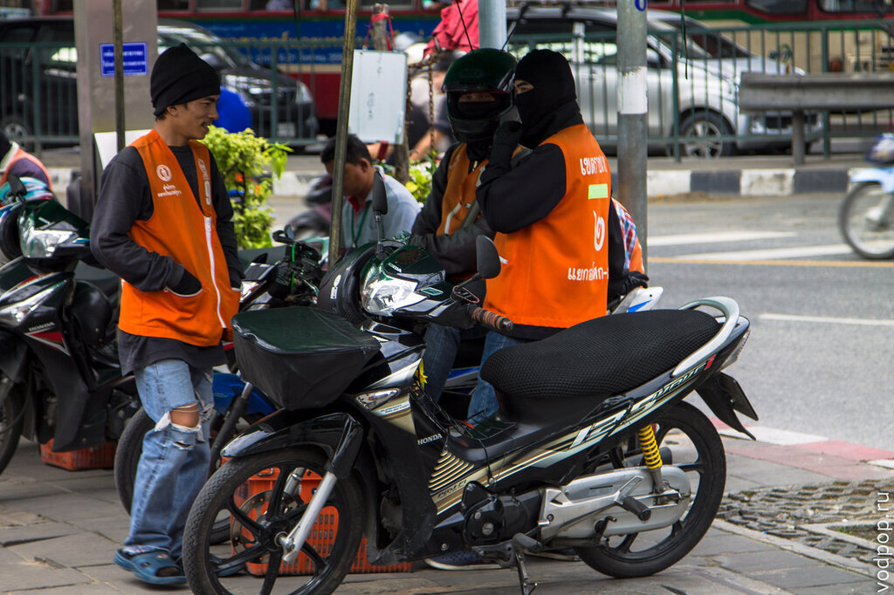
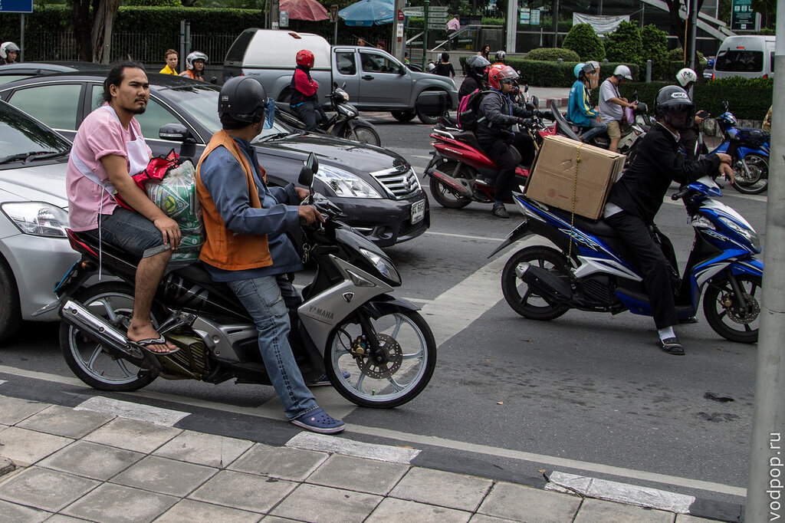
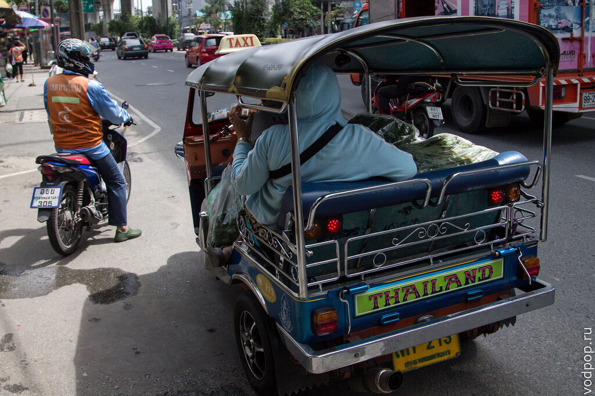
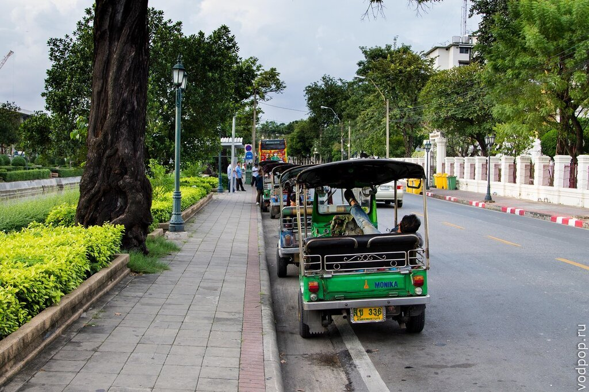
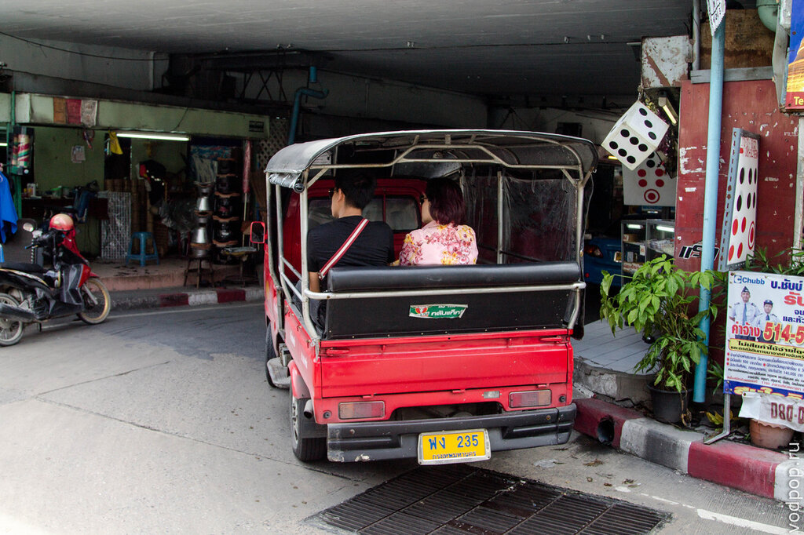
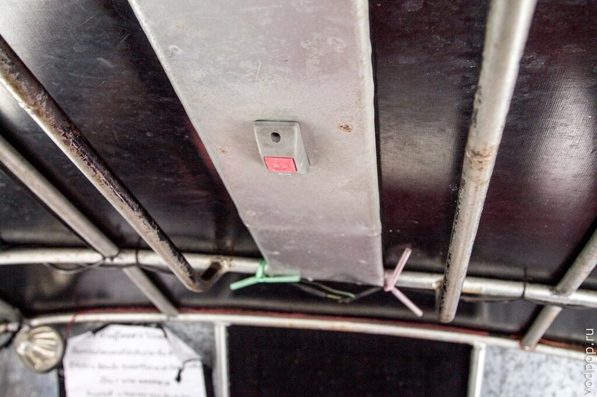
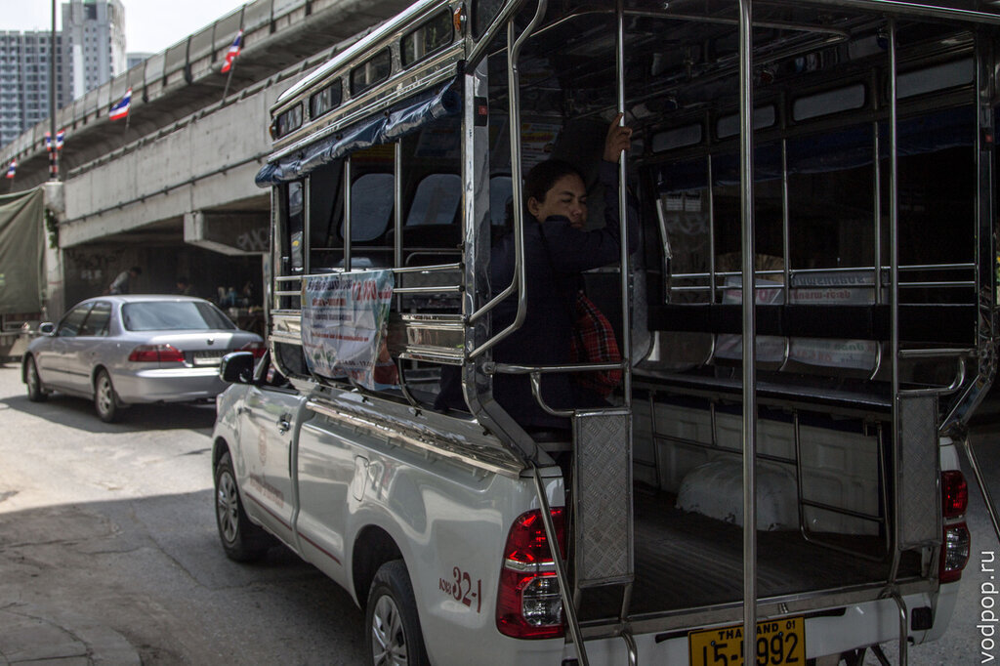

Знакомство с системой общественного транспорта в Бангкоке началось в первые минуты после прохождения паспортного контроля в аэропорту Суварнабхуми (Suvarnabhumi) и продолжается до сих пор. Постараемся подробно рассказать о каждом виде транспорта, о его плюсах и минусах и удобстве использования. Начнем с такси и его производных: мото-такси и тук-тук.

<!--more-->

 

Читайте наши заметки о других видах общественного транспорта в Бангкоке:

[Метро](https://vodpop.ru/metro-v-bangkoke/ "Метро в Бангкоке")

[Автобусы](https://vodpop.ru/avtobusi-v-bangkoke/ "Автобусы в Бангкоке")

[Лодки](https://vodpop.ru/lodki-v-bangkoke/ "Лодки в Бангкоке (Khlong boats)")

 

## Такси

Такси является одним из лучших способов передвижения в Бангкоке, оптимальным транспортом в Бангкоке для путешествия вдвоем.

При посадке в городе вы заплатите 35 бат, в аэропорту - 50 бат. Далее движение будет происходить по счетчику, если это официальное такси. Можно договориться о цене заранее. Это менее выгодный способ, но иногда тайцы ни в какую не хотят ехать по счетчику. Особенно, если они знают, что у вас нет особого выбора - например, идет жуткий дождь, а вы в стороне от основных дорог.

Прошу обратить внимание, что все официальные такси покрашены в фирменный цвет или сочетания цветов, имеют отличительные знаки по бокам машины, а также оснащены шашкой (лампа на крыше). Если они едут по счетчику, то на шашке написано "taximeter", т.е. в переводе - счетчик. Но несмотря на надпись, нужно всегда еще раз спрашивать (Are you going by taximeter?), поедет ли водитель по счетчику и напоминать ему, если он забыл его включить. Для этого нужно произнести волшебное слово "таксиметер".

Во многих такси висят прейскуранты, вы можете рассчитать приблизительную стоимость поездки на такси в Бангкоке (картинка кликабельна).

Однако, необходимо заранее выяснить, есть ли на вашем пути пробки и стараться не ездить в часы-пик, так как за пробки платите тоже вы (1,5 бата в минуту). Пробки тут хуже, чем в Москве (никогда бы не подумала, что где-то может быть хуже!), поэтому можно проехать две автобусные остановки за 150 бат в пробку, а без пробок за 150 бат можно добраться с одного конца города до другого.

Затор около крупного торгового центра в Бангкоке - MBK Center. Почти все машины - такси (розовые, красные, зелено-желтые)

Нравится статья? Узнавайте первым о выходе новых интересных историй! Подпишитесь на нас по [эл. почте](http://feedburner.google.com/fb/a/mailverify?uri=vodpop&loc=ru_RU) или в [группе ВКонтаке](http://vk.com/vodpop)

За платные дороги тоже платите вы. Обычно таксисты стараются их избегать, но если вы точно знаете, что так быстрее - смело говорите ему ехать через нее. Платить вы будете сами,около 40 рублей за 5-10 км пути.

Теперь небольшое уточнение по поводу адреса. Если в аэропорту вас встретит англо-говорящая девушка и объяснит водителю, куда вас нужно отвезти, то в городе такой услуги нет. Вам придется самостоятельно объяснять таксисту, куда вам нужно.

Тайцы хоть и дружелюбны, но очень плохо говорят по-английски, а хоть сколько-нибудь понимающих по-английски таксистов нам удавалось встретить лишь 3 раза за все пребывание. Поэтому смело берите с собой карту, визитную карточку отеля или заведения, куда хотите попасть, открывайте карту на телефоне или постарайтесь заучить свой адрес по-тайски.

Иногда таксист сам не знает куда ехать, к такому лучше не садиться. Мы всегда сначала говорим, куда мы едем, и только если видим осмысленный взгляд в ответ, садимся в такси.

 Оступились мы лишь однажды и переплатили 60 бат (таксист намотал лишний круг на огромной развязке). Мелочь, но неприятно. А иногда водитель может просто перепутать названия и отвезти вас не в ту сторону. В общем, будьте бдительны!

 

## Мото-такси

Водители мото-такси чаще всего представители сильной половины человечества(хотя девушки тоже встречаются), на скутерах в рыжих жилетах и время от времени защитных шлемах.

Шлемы, видимо, носят те, кто уже хотя бы раз падал. Когда смотришь, как они едут, то становится совершенно удивительно, что они не падают. Водитель мото-такси легко маневрирует в пробке, оставляя по паре сантиметров по краям, чтобы пассажир не расцарапал себе ноги.

Преимущество этого способа в скорости на короткие расстояния (например, добраться от отеля до метро) и в удобстве перемещения в одиночку. Однако, стоит заранее у местных узнать, сколько стоит проезд до той или иной точки - мото-таксисты очень любят накручивать цену 2-3 раза, особенно если вы фаранг (иностранец).

 

## Тук-тук и сонгтэо

Тук-тук -  самый дорогой транспорт в Бангкоке. Видимо, они знают, что для иностранцев тук-тук своего очередь must see в Таиланде, поэтому для всех туристов цены на тук-тук запредельные, в 2-3 раза дороже такси. Для местных, похоже. дешевле - таец едет куда-то с пакетом овощей и фруктов.

Однако, они все прекрасно понимают и даже помогают вам поймать такси, если для вас поездка на тук-туке слишком дорогая. В туристических районах тук-тукеры крайне приставучи, тут и там зазывают и кричат цену или как-то привлекают твое внимание. Напаркованные тук-туки недалеко от самого известного храма Ват По. Не самый предпочтительный транспорт в Бангкоке.

Однако, существуют тук-туки для местных, покрупнее, которые ездят по маршруту и отличаются от обычных тем, что три скамьи вдоль кузова.

На лобовом стекле у них написан маршрут на тайском языке, поэтому вы должны заранее знать, по какому пути он поедет. Если вы решили воспользоваться этим видом транспорта в Бангкоке, то вам нужно подойти к автобусной остановке и сесть в первый остановившийся тук-тук. Для того, чтобы выйти, нужно нажать одну из кнопок на потолке.

Стоимость проезда в Бангкоке -  7 бат.

Также в Таиланде весьма популярен сонгтэо (она же двурядка). Этот вид транспорта представляет из себя джип с открытым кузовом, в котором стоит две скамьи. Чаще всего джипы марки Isuzu. Проезд стоит около 20 бат.

