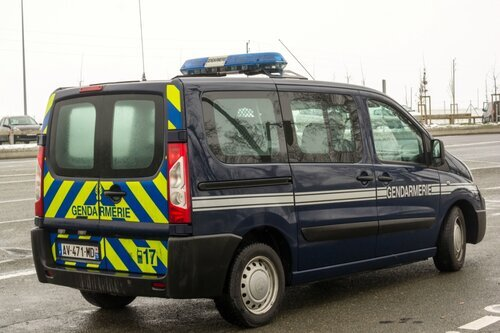
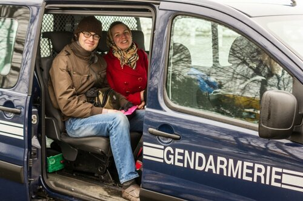
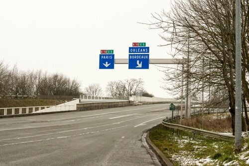
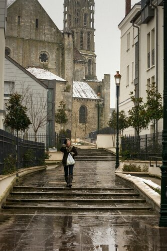
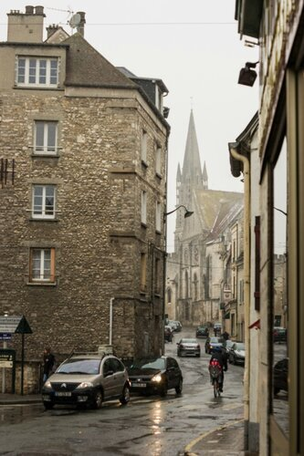
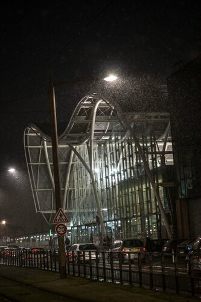

В Париже мы решили арендовать машину, составили интересный маршрут [впечатления](https://vodpop.ru/parizh-frantsiya/) с расчетом 1 марта оказаться в Марселе, нашли компанию (Hertz) и выбрали автомобиль..Но судьба внесла свои поправки — нашу дебетовую нечипованную карту (не знаем, что именно им не позволило взять с нас оплату) не приняли и мы вынуждены были искать другой путь из столицы.

C Gare du Nord мы направились в сторону Dourdan — пригород Парижа. Всего полчаса по линии RER от центра Парижа, но обстановка резко меняется — простые дома, местами пустующие с закрытыми ставнями производили довольно унылое впечатление. Примерно такое же ощущение у меня возникает в некоторых районах Москвы. Чтобы никого не обижать, примеры приводить не буду.

<!--more-->

Сойдя с электрички мы кинулись искать еду и спрашивать всех на англицком, есть ли у них суп.. И вот наше первое потрясение — в 50 км от Парижа английского никто не знает и не понимает! Намного лучше у них с итальянским, так как в пригороде живет много иммигрантов.  
В кафе мы кое-как объяснили, что хотим взять на обед. Причем больший фурор произвел не столько язык, на [wholesale mlb jerseys](http://www.cincinnatibengalsjerseyspop.com) котором мы пытались с ними поговорить, сколько наше странное пожелание разделить одну порцию на двоих — целую непосильно съесть даже натренированному на поедание сырых стейков мужчине. Итак, оставив весьма внушительную сумму в этом заведении (в лучших традициях — Долго, Дорого, Ах..ну и дальше сами знаете), мы отправились ловить удачу на трассе.  
Двумя машинами мы добрались до автобана — нас высадили рядом и несмотря на мои громкие протесты не выходить туда (у нас уже был горький опыт в Берлине), Климентий уверено повел меня через сломанный забор.  
10-15 минут томительного ожидания и на горизонте появилась машина аварийно-спасательных работ, которая остановилась подле нас и водитель на ломаном французско-английском языке объяснил, что автостопщикам здесь ( как и всем прочим смертным без машинки) находиться никак нельзя, поэтому за нами приедет машина полицейских. Мы прождали их около получаса, посмеиваясь и стесняясь достать виски, чтобы согреться (мы еще не знали, чего ждать от жандармов). В ту минуту, когда водитель сообразил, что мы совсем замерзли и пустил нас к себе в салон, заставленный дорожными конусами, подъехала машина с полицейскими.На наше удивление они вежливо узнали куда мы едем и…(внимание, барабанная дробь!)… предложили нас отвезти до съезда на место назначения! Мы, конечно, в шоке сели в машину и пока мы проводили параллели с нашими полицейскими, [и](https://vodpop.ru/disneylend-frantsiya/) уже оказались около пункта оплаты автобана — здесь наши доблестные «спасатели» отобрали у нас камеру… чтобы сделать снимок «На память из Франции».  
Все это было сказано с улыбкой и разбавлялось их попытками вспомнить несколько слов на русском. У нас проверили паспорта, но так как это заняло не больше минуты, мы не сильно расстроились.  
С местом повезло чуть меньше — на пунктах оплаты все смотрели и улыбались, но никто не останавливался почти полчаса.Мы решили сменить дислокацию и уже через 30 секунд сидели в теплой машине.  
Наш путь проходил через симпатичный небольшой городок Этапм (Etampes), где наспех затарившись шоколадками и водой, мы пошли искать подходящее место для стопа.  
Свернув с большой дороги, мы буквально наткнулись на огромный, пустынный храм Notre-Dame-du-Fort d’Étampes, о существовании которого и не подозревали, пока не подошли поближе.

Мы зашли внутрь — там сидел всего лишь один человек и атмосфера тянула остаться, посидеть подольше. К сожалению, у нас не было на это времени, и мы вынужденно отправились дальше по лужам в путь.  

Что забавно — погода была поистине ужасная и водителям было тяжело останавливаться, да и не видно издалека. Но за время всего автостопа нас несколько раз подвозили, в буквальном смысле рискуя частью бампера и боковины — люди останавливались на съездах с дорог, перегораживая всем движение. Или пример особенно запомнившейся мне семьи, которая ехала на минивене. Когда они остановились, у меня от хохота даже ноги согрелись — их было ДЕВЯТЬ человек. Мы закинули (а точнее добросердечный водитель этого маленького автобуса — отец семейства) рюкзаки в багажник и попросили нас подкинуть в сторону Тура — это была конечная точка нашего дневного маршрута. Настроение портилось, ноги у обоих промокли насквозь, и мы приняли решение не стопить, а доехать оставшиеся километры на электричке. Все тот же добрый водитель не только сделал крюк километров в 20, но еще и высадил нас прямо напротив вокзала, нарушив ради этого не один пункт ПДД.

Что бы не говорили и не думали про автостоп, плохие люди не останавливаются (или же нам так невероятно везет) — водители и пассажиры готовы страдать и говорить на забытом английском, угощать едой, улыбаться, останавливаться в неположенных местах.. Резюмируя данное предложение дорогие водители, которые подвозили нас в это путешествие, огромное вам СПАСИБО!  
А пока вы читали лирическое отступление, мы [Берлин.](https://vodpop.ru/berlin-germaniya/) уже доехали до Тура и остановились в одной из симпатичных гостиниц рядом с вокзалом.
