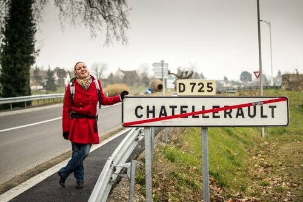
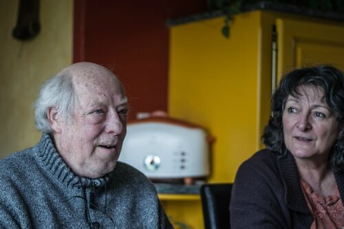
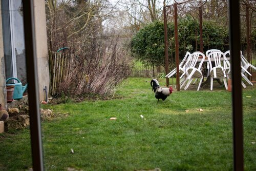
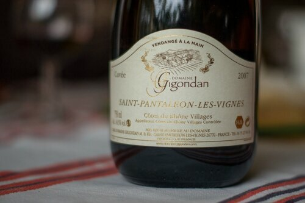
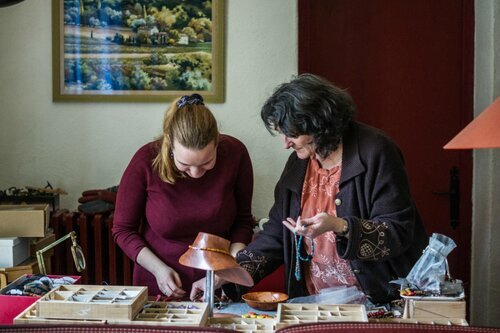
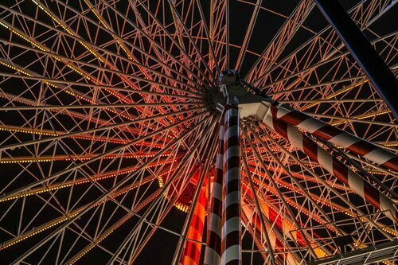

Шательеро - довольно крупный город, поэтому внутри него мы почти никого не застопили, не считая одну девушку, которая довезла нас до автовокзала. Мы было хотели уехать на автобусе, но нужный нам ушел буквально за 5 минут до нашего прихода, а следующего надо было ждать почти час. Мы решили не терять времени даром - проложили маршрут на карте и пошли пешком. Больших дорог мы теперь старались избегать, поэтому смело шли по бордюру, не боясь проезжавших машин. Была даже девушка, которая сама остановилась и пыталась нас подвезти, только ей было в противоположную сторону от нашего пути. Мы оценили ее доброту и пожелав доброй дороги, продолжили нашу пешую прогулку.

<!--more-->

Надо сказать, что если все время идти, да еще и в горку, то довольно быстро согреваешься. Только стопить в движении - плохо. Приходилось идти на копромисс - я шла, Клим догонял. И вот в один из таких моментов решившая нас подбросить машинка, остановилась на тротуаре встречной полосы и мы бегом сиганули к ней. За рулем оказался пожилой мужчина. В машине место было ровно для одного - для водителя, ибо огромная сумка с продуктами стояла на переднем пассажирском сидении, а задние ряды были заняты двумя велосипедами. Кое-как втиснувшись и мысленно не переставая удивляться, мы поехали. Мужчина довольно свободно говорил по-английски, поэтому ехать с ним было одно удовольствие. Через полчаса пути он предложил нам заехать к нему домой, чтобы оставить сумку с продуктами и подвезти нас до ближайшего городка. Мы подъехали и неожиданным образом оказались приглашены к столу на обед. Кристиан и Ив - супружеская пара, живущая в прекрасном доме, поразила нас своим гостеприимством и добротой.

 Нас угостили настоящим французским деревенским обедом, но больше всего нас поразил дом. Половина дома относится к 19 столетию, а пристройка выполнена в схожем стиле, с окнами от пола до потолка. Внутренний дворик с качелями для 6 внуков (у Кристиана и Ив трое детей), небольшим огородом и даже курятником!

Оказалось, они большую часть жизни прожили в Африке, и это очень чувствовалось по обстановке - деревянная массивная кухня, но стены кирпичного цвета и на полках фигуры из слоновой кости. Клетчатые скатерти, блюда, вручную расписанные Ив (она художницв) - ощущение уюта и тепла. А еще нас угостили лучшим вином , которые мы когда-либо пробовали- Domaine Gigondan Saint-Pantaléon-Les-Vignes Côtes du Rhône Villages 2007.

После обеда Ив показала мне свою мастерскую - она делает багеты, рисует картины и делает украшения. На фото ее рабочий стол, заставленный коробками с бусинами.

На прощании мы расцеловались с Ив (она подарила мне сережки своей работы) и Кристиан посадил нас в машину, чтобы (как оказалось) провезти нас еще 30 км до городка Ле-Блан (Le Blanc), где высадил нас на остановке для отдыха и дал нам свой контактный номер, чтобы мы ему позвонили, если не удастся уехать. Стоит сказать, что если бы не гостеприимный Кристиан, мы бы обязательно походили по вышеупомянутому городку - из окна автомобиля он показался нам сказочным - замки, башни, конюшни.. Но все было слишком идеально, чтобы просить об остановке. В этот день нам невероятно везло - не прошло и 10 минут, как нас подобрали до Лиона и вечером мы уже катались на колесе обозрения на центральной площади.

