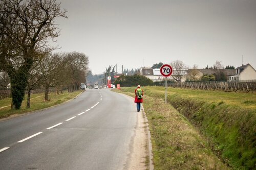
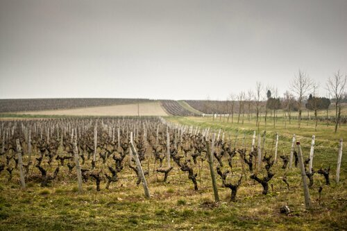
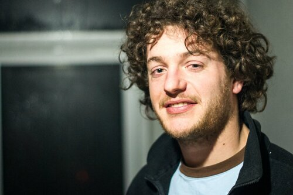
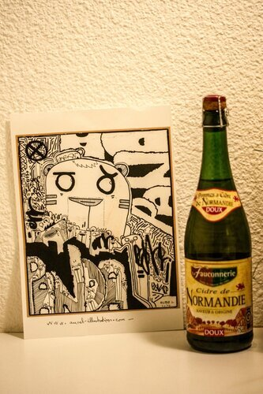

Безуспешно пытаясь найти что-то съедобное (ни одно магазина, ни кафе - ничего открытого), мы дошли до заправки, где залили в себя топливо в виде печенек и кофе, и вышли здесь же ловить машину. <!--more--> Надо сказать, что вокруг почти всегда нас окружала красивая природа. Самый частый пейзаж, конечно же, виноградники

Сразу остановилась машинка, в которой ехала семейная пара с дочкой лет 14 - она потеснилась на заднем сидении, чтобы мы смогли влезть и затащить внутрь рюкзаки. Чем дальше от Парижа, тем крупнее встречались машины - в маленьких городах нет такой глобальной проблемой с парковкой, но несмотря на это водители паркуются очень аккуратно и почти никогда не нарушают правил. В три пересадки мы очутились в забытом, глухом городке, название которого я даже не вспомню. Как пишут классики: Смеркалось.. Мы одели на руки светоотражающие браслеты и повернули рюкзаки с отражателями в сторону водителей, которые неумолимо проезжали мимо нас. И через полчаса, когда нам уже в конец наскучило стоять на одном месте, остановился парень на Альфа-ромео (неудобная машина, ей я была разочарована), мы очень ему обрадовались и попросили подкинуть в сторону Марселя. Когда мы говорили людям, куда лежит наш путь, они смеялись,а некоторые даже не верили. В конце концов парень высадил нас на крупной развязке, где ему было совсем в другую сторону. Было уже откровенно темно. В этом основное преимущество автостопа летом - в 20.00 на улице светло как днем, да и погода приятнее. Но нельзя ни о чем жалеть, потому что не случись этого, мы бы не познакомились с замечательными людьми, которые и забрали нас с этой развязки на белом фургоне. Сказать, что водитель и пассажиры удивились, узнав что мы стопщики из России - не сказать ничего. Их шок усугублялся тем, что мы абсолютно не говорим по-французски (нет, я конечно могла выдать что-то вроде же мапель Саша,- единственное, что осталось от моего изучения языка) и едем до Марселя. Они оказались группой строителей, что работает на стройке нового моста TGV (аналог нашего РЖД). Почти все родом из Нормандии - Северной части Франции. Когда они пригласили нас к себе в гости, мы уже ничему не удивлялись и согласились выпить кофе с такими веселыми и дружелюбными людьми.

Нас познакомили со всеми остальными членами команды - их было около 7 и мне сразу пришла в голову веселая мысль, что они невероятно похожи на современную экранизацию "Белоснежки и семь гномов". Вот только Белоснежки у них не было - эти очаровательные мужчины варили друг другу растворимый суп и помогли нам согреться, приготовив кофе и даже залив Климентию туда порцию виски.

На всю компанию нашелся только один парень, который говорил по-английски и понимал почти все, что мы пытались сказать. После часа, проведенного у них в гостях, мы не только приняли на веру, но и согласились, что нормандцы - самый дружелюбный и веселый народ. Хотя викинги.. Как бы то ни было, нас задарили подарками - мне подарили книгу на французском, чтобы я учила язык, бутылку Сидра, картину, наклейку с викингами и массу улыбок и приятных впечатлений. А после всего этого нас еще и подвезли 25 км до гостницы в Шательеро(Châtellerault)

Нам было очень стыдно, что мы ничего не могли им подарить из России (в следующий раз обязательно купим сувениры), но они даже слушать не хотели и несли все новые и новые подарки.. Веселые, по-хорошему уставшие, мы с их помощью оказались в гостинице, где поужинав болоньезе на двоих (ох уж эти порции), мирно уснули.
