[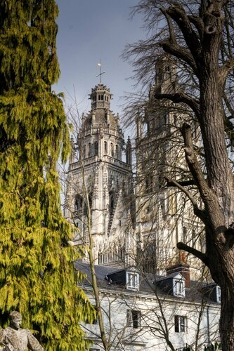](https://vodpop.ru/tour-de-france-tur-shenonso/)

Проспав на следующее утро выезд из гостиницы (милая бабушка на ресепшн нам простила 1,5 часа), мы пошли искать экскурсионное бюро, чтобы отправиться в замки Луары. Пришли немного заранее, поэтому решили прогуляться по окрестностям. Тур - город, где родился известный французский писатель Оноре де Бальзак. Мы прошлись по средневековому кварталу, ведущему к главной достопримечательности города - собору Сен-Гатьен (Cathédrale Saint-Gatien), ничуть по красоте и величию не уступающей главному собору Парижа. <!--more--> Как я уже говорила, Париж был полон маленьких открытий, но это относится и к остальной части Франции - здесь никогда не знаешь, что увидишь за поворотом и даже путеводители не расскажут всего того, что можно увидеть своими глазами. Рядом с собором был разбит сад, который мы не успели как следует посмотреть, так как рассчитывали уехать на экскурсию. При входе могучими стеблями уходит в землю огромный ливанский кедр, ровесник Наполеона Бонапарта.

[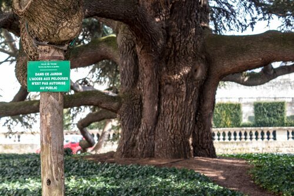](http://fotki.yandex.ru/users/klimentij511/view/805053/)

К сожалению, не смогли найти ракурс, с которого можно оценить размер дерева, но поверьте на слово - он огромный.

[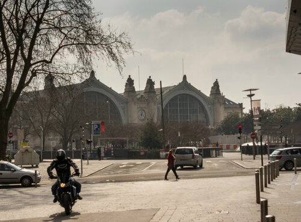](http://fotki.yandex.ru/users/klimentij511/view/805055/)

Вернувшись на главную площадь города, мы предприняли тщетные попытки дождаться экскурсионный автобус (бюро было закрыто на обед), но после 20-минутного ожидания бросили и купили билеты до Шэнонсо - деревушки, в которой по отзывам большинства путешественников, стоит самый красивый замок в Долине Луары.

[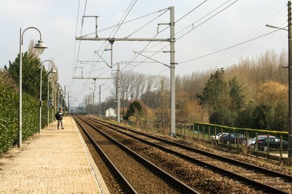](http://fotki.yandex.ru/users/klimentij511/view/805057/)

В последствии мы очень обрадовались, что не попали на экскурсию - ведь куда приятнее ходить одним, без сопровождения толпы туристов, желающих сделать фотографии в духе "Я и достопримечательность".

[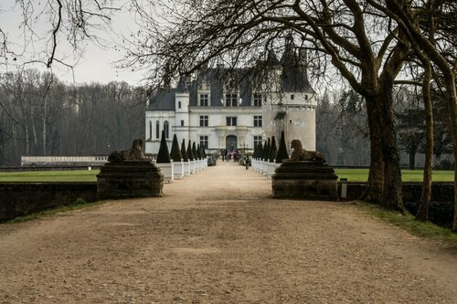](http://fotki.yandex.ru/users/klimentij511/view/805061/)

В Замке есть брошюра на русском языке, но я настояла взять еще и аудиогид - айпод с установленным ПО выдается под залог паспорта в просторной гостиной, где стоит камин и откуда начинается повествование. Оптимистично выставив режим на час (есть еще и сокращенный вариант - на 45 минут), мы вслед за голосом из наушников пошли по внутренней части замка. На мой вкус - слишком подробно и ни к чему. Единственное, что я четко запомнила - это то, какими разнообразными могут быть [пилястры](http://ru.wikipedia.org/wiki/%D0%9F%D0%B8%D0%BB%D1%8F%D1%81%D1%82%D1%80%D0%B0). Внутренняя часть замка нам показалась даже менее привлекательной, чем окружающие его сады, палисадники и река. Слишком много камня - внутри холодно даже в тех комнатах, где есть камин. И "неуютно", как сказал Климентий. Наверное, уют в те времена не был в почете. Зато кухня на нас произвела впечатление - все продумано с умом - вода из реки, насосы, специальные грузики для переворачивания дичи - за эту информацию надо отдать должное аудиогиду - мне бы в голову не пришло высматривать грузики на веревках за окнами. Внутри вежливо, но настойчиво просят не фотографировать, но почти все ходят и щелкают фотоаппаратами.

[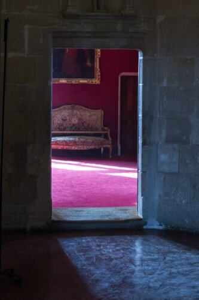](http://fotki.yandex.ru/users/klimentij511/view/805065/)

Порядочно продрогнув в замке (честное слово - холодно!), мы вышли "отогреваться" на территорию. Климентий проголодался, но в зимнее время рестораны на территории замка закрыты, а в самой деревушке работают только после 19.00. Берите еду с собой! [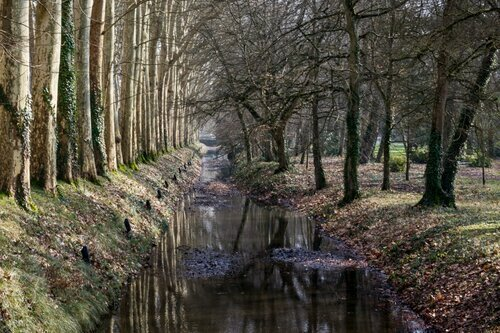](http://fotki.yandex.ru/users/klimentij511/view/805058/)

Было здорово, что на территории оказались камеры хранения, куда мы закинули наши рюкзаки ( там даже есть специальные большие отделения под них), но минус в том, что они не охраняемые. Мы решили, что никто нас грабить не будет и спокойно осматривали территорию на протяжении часа, пока еще были способны впитывать прекрасное.

[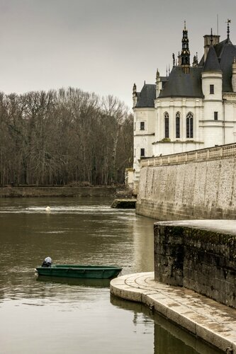](http://fotki.yandex.ru/users/klimentij511/view/805067/)

Очень приглянулся домик смотрителя - наверное, у него были железные нервы - я не представляю, как можно уследить за таким огромным хозяйством. [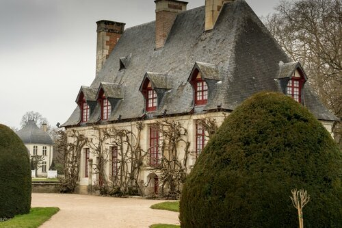](http://fotki.yandex.ru/users/klimentij511/view/805069/)

Особенность внутреннего убранства - красивейшие композиции из живых цветов, которые выращивают здесь же, на территории замка. Мы гуляли по оранжерее и видели цветы, спрятанные под стеклянными колпаками.

[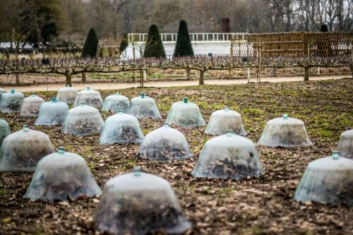](http://fotki.yandex.ru/users/klimentij511/view/805076/)

Обновляют букеты раз в неделю, поэтому садовникам здесь есть чем заняться - их немало и каждую минуту времени они что-то делают.

[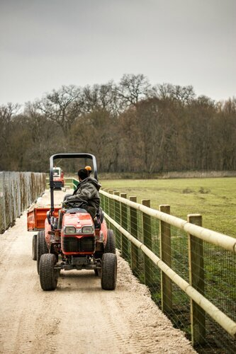](http://fotki.yandex.ru/users/klimentij511/view/805072/)

Немного сбоку от основной, видимой части парка, спрятаны рабочие помещения - там раньше были стойла для лошадей (теперь там припаркован Бентли), хранилища припасов и в центре всего этого два прудика, где до сих пор разводят птиц. Одна из таких красавиц попала нам в кадр.

[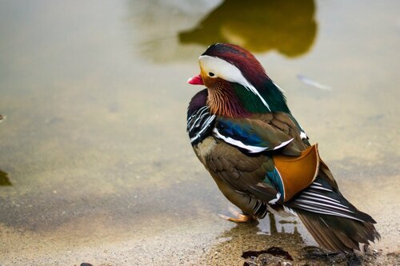](http://fotki.yandex.ru/users/klimentij511/view/805077/)

Через ворота можно выйти к детской площадке, а затем снова к замку.

[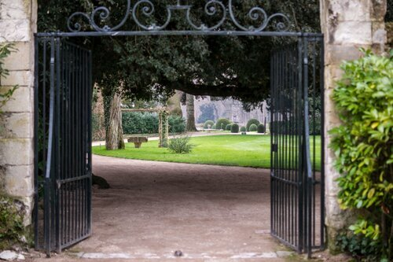](http://fotki.yandex.ru/users/klimentij511/view/805079/)

Завершив наше путешествие по территории мы отправились дальше - искать путь в сторону Марселя.
