За несколько дней мы проехали центральную часть Норвегии, увидели крупные города и дикие степи. Проехались вдоль океана по самой красивой Атлантической дороге, второй раз в жизни пересекли полярный круг и поднялись по одной из самых опасных дорог в мире - Тропе Троллей.

<!--more-->

С предыдущими частями можно ознакомиться по ссылкам, что ждут вас внизу страницы.

## День 8. Бодо - Трофос

Напомню,  что мы переплыли в Бодо на пароме, на котором познакомились с автостопщиком из Гамбурга. Мы пожаловались ему на [ужасный автостоп в Германии](https://vodpop.ru/berlin-germaniya/ "Берлин. Германия"). Надо сказать, что общение проходило довольно легко благодаря тому, что Рауль прекрасно знал английский язык.

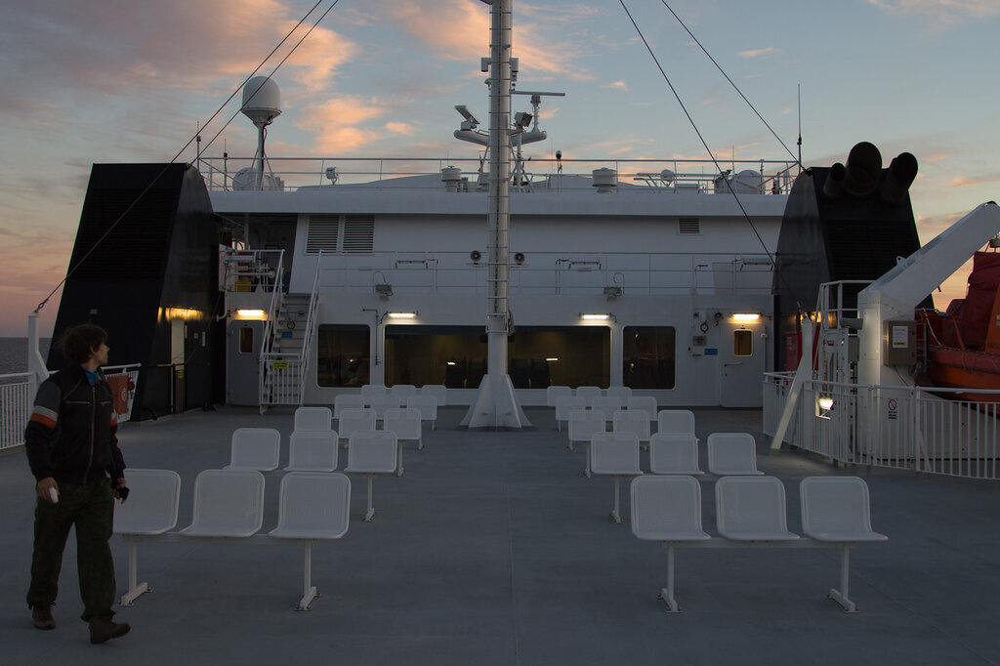

К слову, о языке в Норвегии - все норвежцы, от мала до велика знают английский в совершенстве, вне зависимости от профессии, социального положения или географического расположения. Например, работники парома расстраивали нас ценами на чистейшем английском..

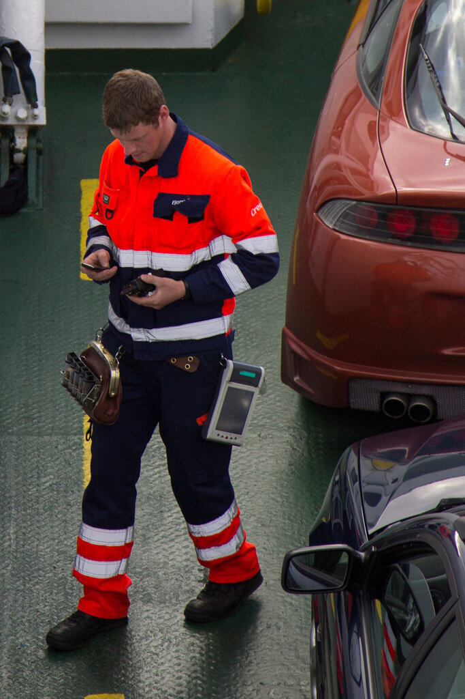

Взяв Рауля пятым пассажиром в машину (Шкода-грузовик!) мы решили не искать кемпинг, а поспать в палатке и спальниках. Рауль поставил свою палатку по соседству, и мы дружно отправились в царство Морфея.  После пробуждения мы отправились в сторону Тронхейма , вдоль железной дороги.

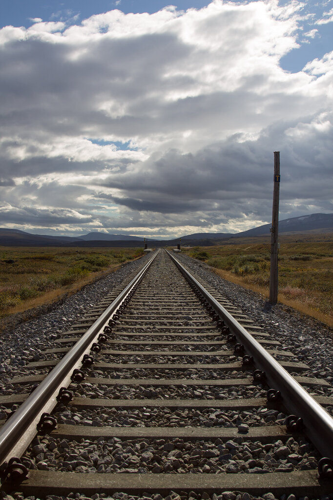

А заприметившие нас олени, гулявшие вдоль путей, где растет черника и голубика, бросились в рассыпную.

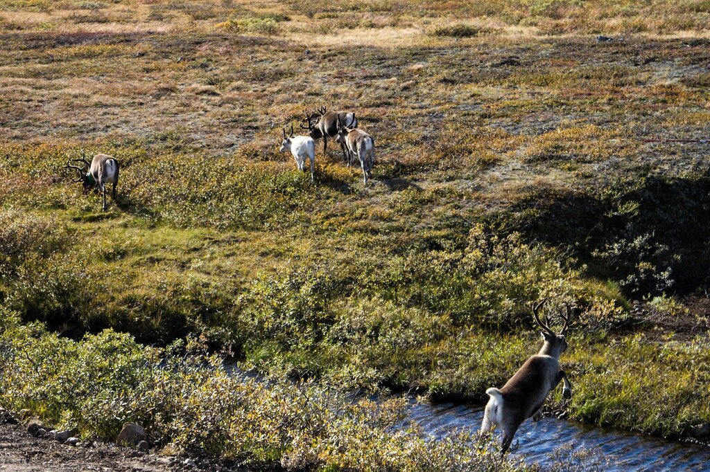

Второй раз в жизни мы побывали на Полярном круге (первый раз был во время поездки в Мурманск).

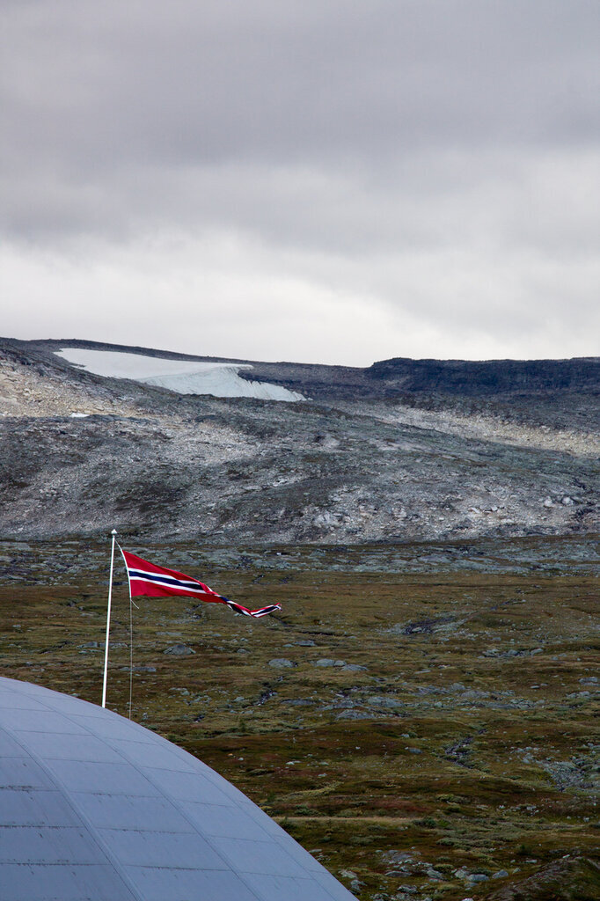

Указатели на деревянном столбе показывали географическое расположение  фюльке (районов) Норвегии - их всего 19.

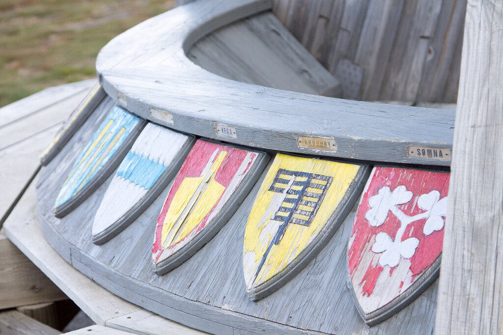

Если подняться на холм, можно увидеть довольно странную картину - множество стопок из камней. Только после возвращения в Россию, мы узнали, что эти камни, сложенные в кучу, образуют троллей. И каждый турист складывает своего тролля, чтобы ему сопутствовала удача.

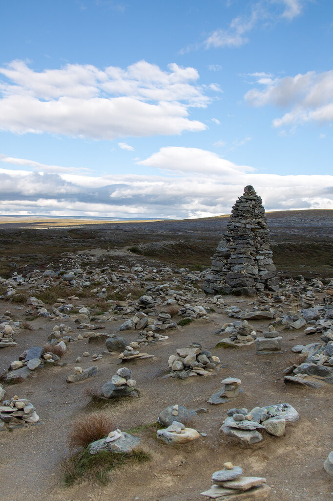

Далее мы ехали без остановок, потому что начался довольно сильный дождь, и желания вылезать из машины ни у кого не было. Однако, мы внимательно смотрели по сторонам и в одном из городков увидели Рауля (автостопщика), стоящего под проливным дождем. Он долго не мог уехать, и мы решили взять его с собой, чтобы вместе искать ночевку.

Выбор пал на [Svenningdal Camping](http://svenningdalcamping.123hjemmeside.no/)  в городке Трофорс ,в котором домик стоил всего 400 NOK и были такие узкие кровати, что выспаться удалось не всем (домик предназначен для троих).

## День 9. Трофорс - Ондалснес

Из-за экономии времени на остановках в машине иногда случались казусы.

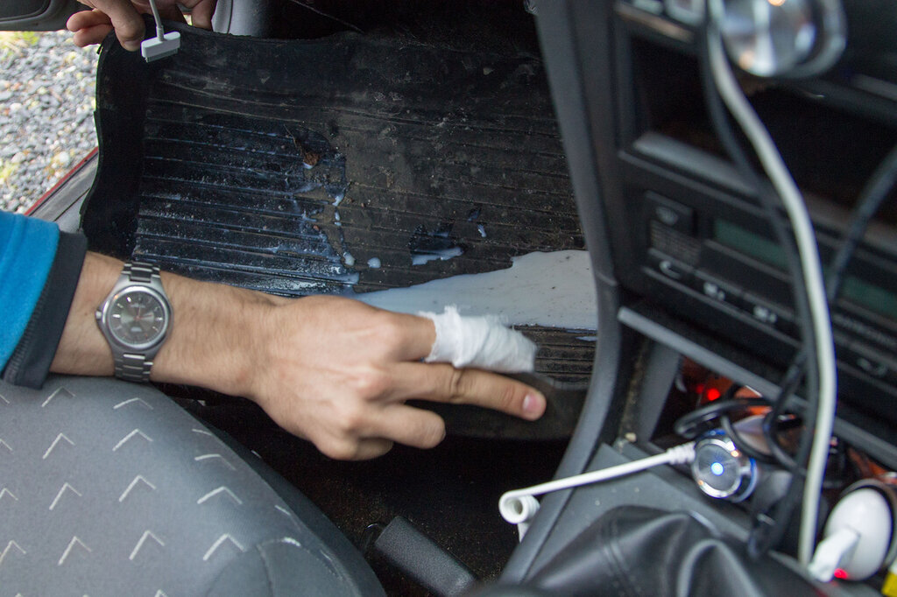

Впрочем, разлитое молоко не самое страшное, что могло случиться. Еще перед въездом в Финляндию у нас вдруг перестала работать магнитола. Мы проверили все предохранители, но толку было ноль. Решив не терять на этом время, мы подготовились к прослушиванию музыки с телефонов на протяжении всей поездки.

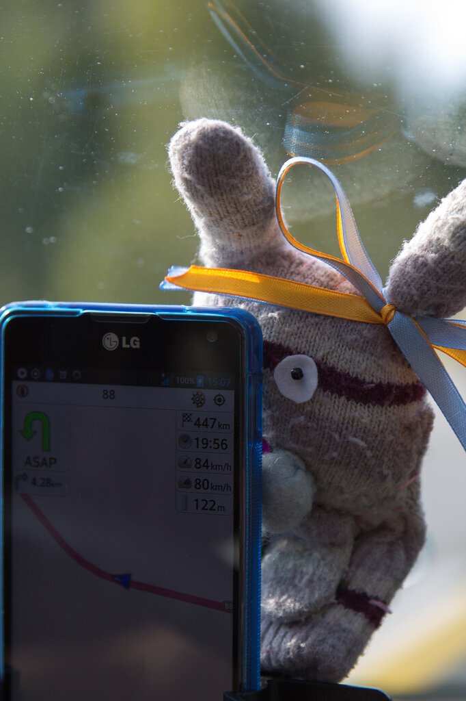

Одна паромная переправа и жутко дорогой платный тоннель (точь-в-точь такие же по всей стране бесплатны), и мы выехали на самую упоминаемую в путеводителях по Норвегии Атлантическую дорогу.

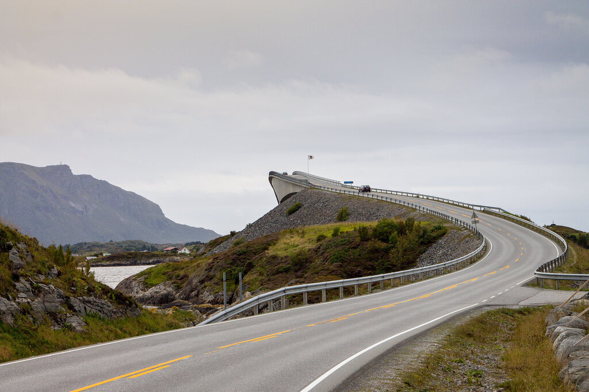

Островки суши соединены между собой мостами. Один из самых длинных мостов Атлантической дороги - Сторсезандетский мост. У некоторых голова начинает кружиться от одного взгляда на это сооружение, может именно поэтому местные жители называют его еще "пьяный мост". С разных углов на дорогу открывается абсолютно разный вид. Например, в определенном ракурсе кажется, что мост не достроен.

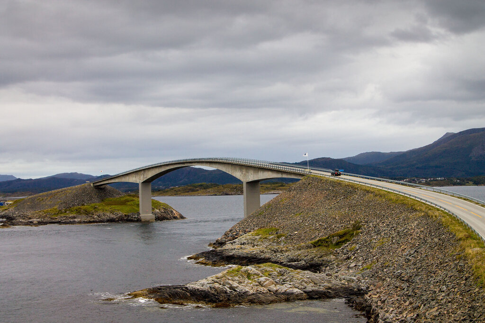

Для туристов на собственных автомобилях есть специальное место для парковки. В других местах припарковаться практически нереально - везде отбойники.

Есть даже небольшие пешеходные мостики слева и справа от дороги.

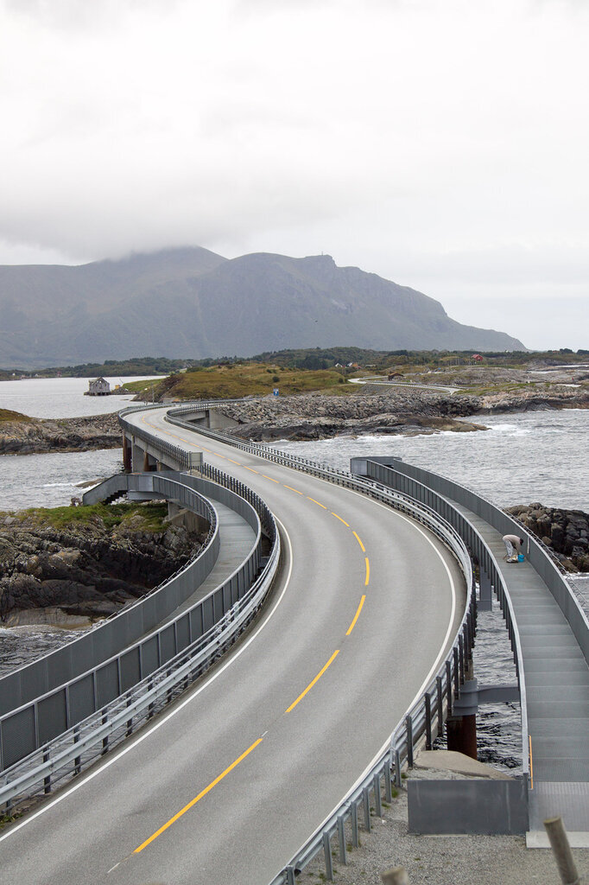

Если еще немного прогуляться, можно выйти прямо к Атлантическому океану.

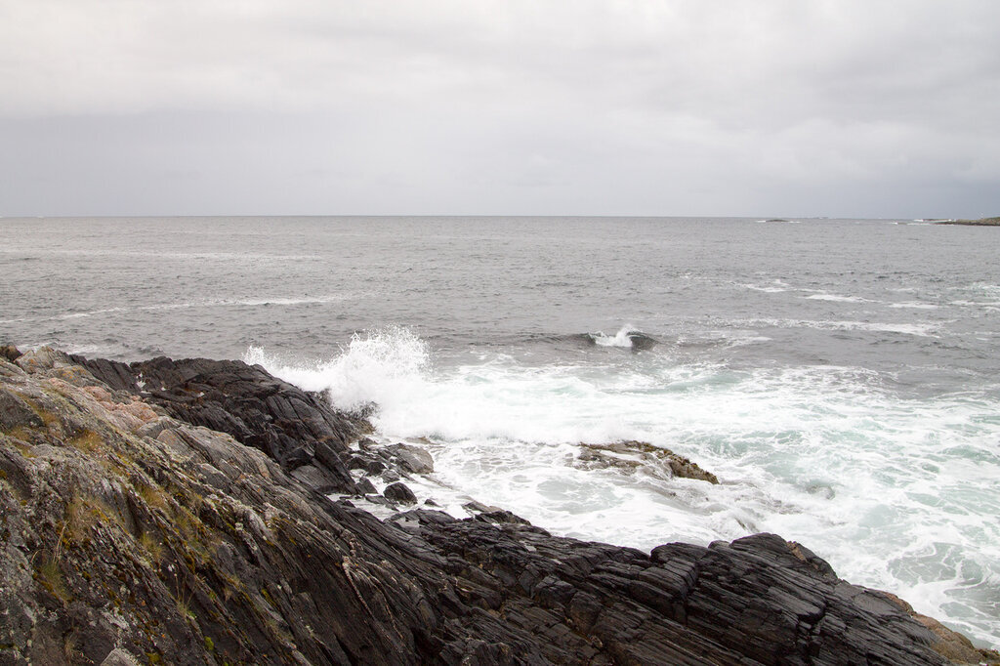

В общей сложности мы провели там около часа. Возможно, в солнечную погоду мы бы даже попробовали искупаться, но было слишком пасмурно и ветрено - мы отправились к месту следующей ночевки в [Åndalsnes Camping](http://www.andalsnes-camping.net/home). К ресепшн подъехала очень атмосферная норвежская дама, на огромном серебристом джипе и отдала нам ключи от нашего дома.

Нашей радости не было предела, когда мы увидели на столике маленькое радио, откуда играла хорошая музыка - рок-н-ролл, старый американский рок и джаз. Если вспомню название радиостанции, обязательно поделюсь.

## День 10. Ондалснес - Эурланн

Сегодня нам повезло с погодой - было тепло и солнечно.

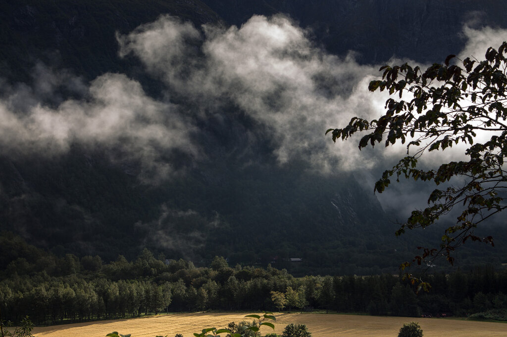

Ради таких видов стоит поехать в Норвегию.

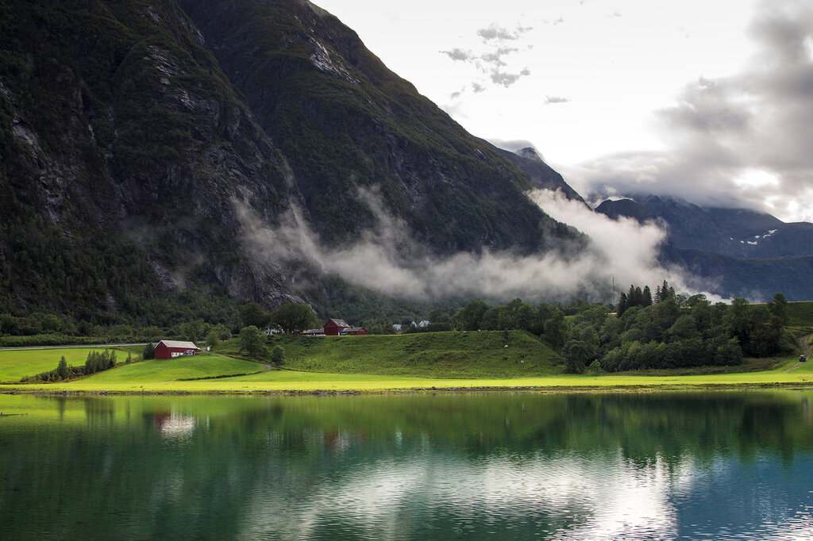

Через полчаса после выселения из кемпинга мы уже были у подножия Тропы Троллей. Хотя правильнее было бы сказать "Лестница Троллей". Если присмотреться, то извилистая дорога действительно напоминает ступеньки, по которым ночью шагают тролли.

, Норвегия")

Почему ночью? Согласно  мифологии, тролли - это уродливые существа, рожденные из скалы, чаще всего от 3 до 8 метров ростом, которые на солнце опять превращаются в скалу. Вопреки распространенному мнению, они не всегда вредят человеку - зачастую помогают ему в решении разных проблем.

Крайне необычная постройка - кафе для туристов, забравшихся на самую вершину Тропы.

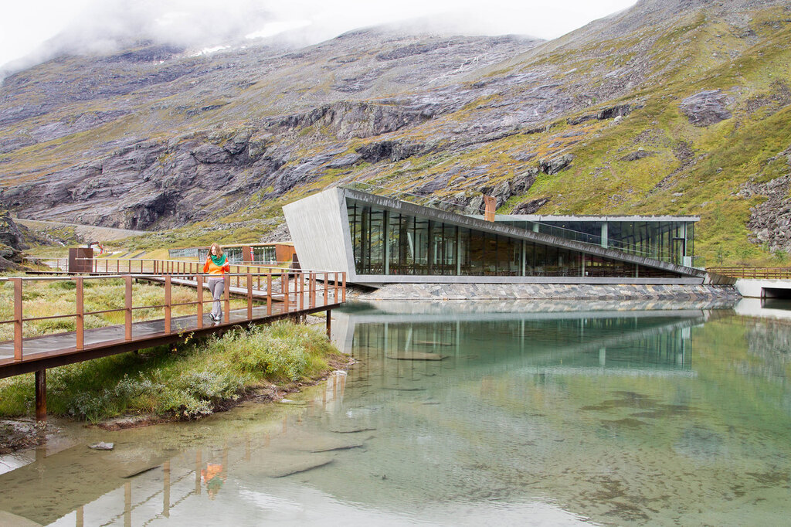

Если подъем мы преодолели весьма спокойно, то спуск прошел "с ветерком". Любознательным предлагаю посмотреть видео, а менее любопытным дам совет - спускаетесь на скорости 100 км/ч тогда и только тогда, когда вы на 200% уверены в своих тормозах!

<iframe src="//www.youtube.com/embed/20sN5tWjBYs?rel=0" width="640" height="480" frameborder="0" allowfullscreen="allowfullscreen"></iframe>

Тропа нам так понравилось, что мы поднялись еще раз и поехали через горы в сторону Олесунна. Хотя "поехали" громкое слово - мы опять останавливались на каждом пятачке, где это было возможно. На этот раз мы фотографировали не только природу, но и себя. Спасибо автоспуску!

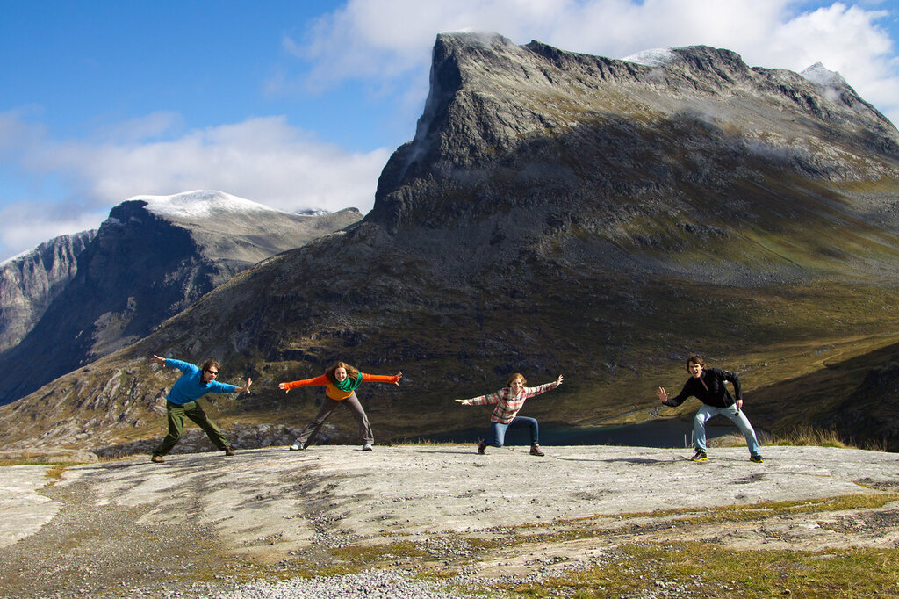

Типичная картина начиная с центральной части Норвегии - гуляющие повсюду овцы. Чтобы они не убегали с пастбища (это открытая площадка вдоль дороги, без забора) на дороге делают что-то наподобие канализационной решетки-несколько труб круглого сечения не позволяют им пройти, так как копыта "прокручиваются". Зато можно с радостью почесаться об отбойник.

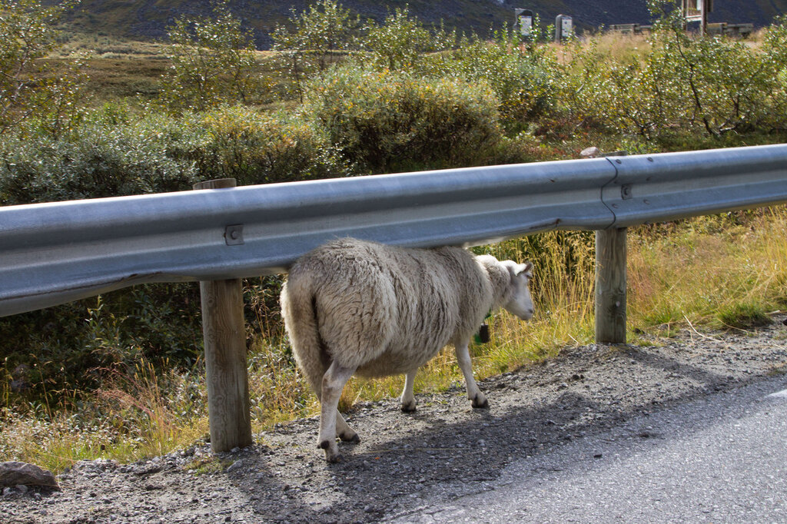

Сопровождаемые овцами и оленями мы приехали в город Олесунн. Яркий, красочный, с мощеными улочками, большими торговыми центрами и множеством кафешек. После городов северной Норвегии почти мегаполис.

, Норвегия")

Приятно гулять по улочкам с историей.

")

Лодки, парусные яхты - на любой вкус и кошелек. Можно договориться с хозяином лодки  - прокатиться вдоль берега и выйти в открытое море.

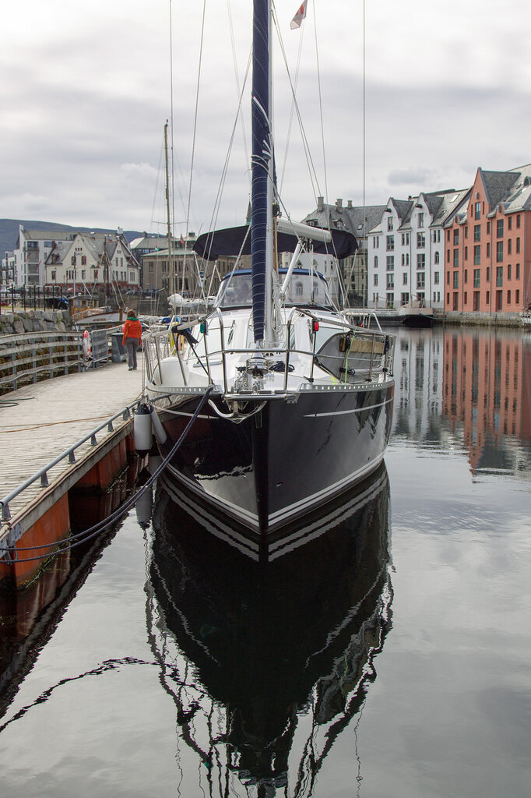

Здесь же мы попробовали вкуснейший белый норвежский суп - на сливках, с рыбой и другими дарами моря. Суп стоил 130 NOK, зато порция была королевская. Сфотографировать его не удалось по причине дичайшего желания съесть поскорее. Опомнились только тогда, когда съели последнюю ложку.  Вместо этого будет фотография красивой птицы, сидящей на берегу. Может, кто-то знает, что это за вид?

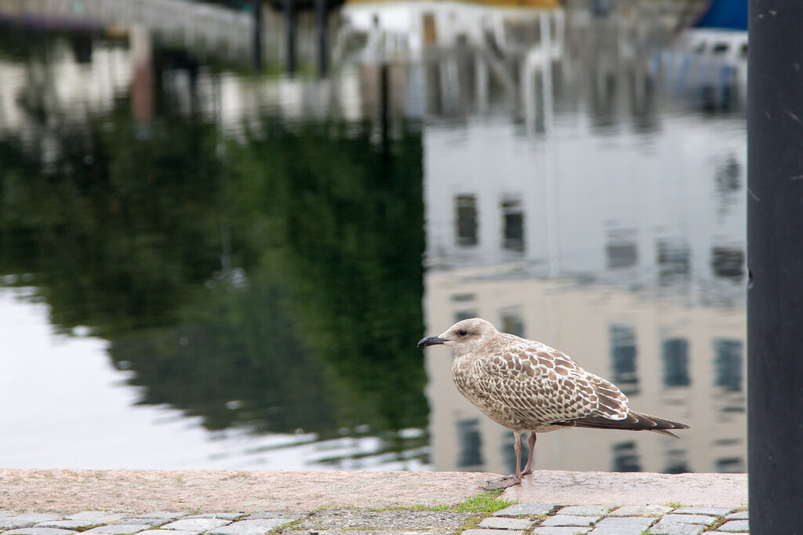

Пешая прогулка по городу отняла много сил, поэтому мы были рады вернуться в машину и продолжить свой путь. Могу сказать с уверенностью, что пятые точки всех участников поездки еще долго имели форму сидений Шкоды (отнюдь не предназначенных для путешествий на такие расстояния). Поэтому иногда было очень приятно делать вот так.

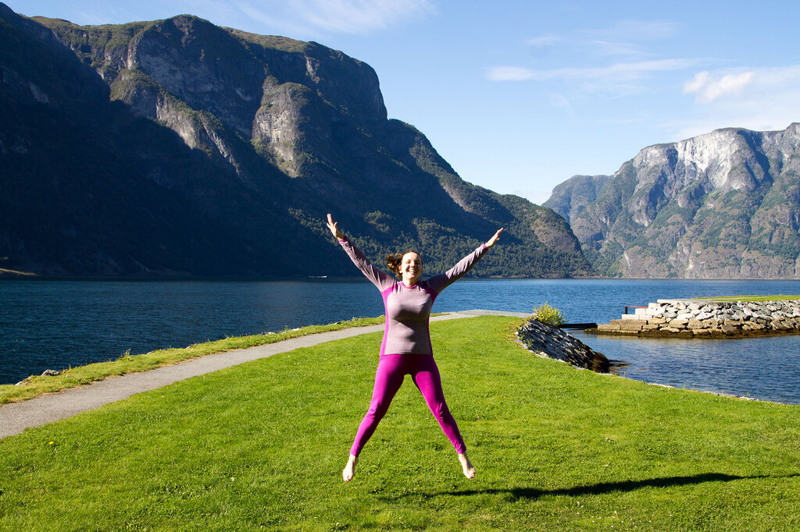

Тем временем, уже стало плохой традицией позднее прибытие к месту ночевки: скитания между закрытыми дверями кемпингов, и, о чудо - нашелся владелец кемпинга, который не поленился приехать и забрать наши деньги (вот тут мы первый раз и увидели наличные).

И все бы хорошо, но мы совершенно не подумали, что вода не включена в стоимость домика. Да, такое бывает! Причем в кемпингах Норвегии особо распространено -в стране отсутствует централизованное отопление, поэтому нужно кинуть монетку в специальный приемник и только тогда потечет горячая вода (из бойлера или поточного нагревателя мы не поняли). Либо мыться под ледяной. Каждый сделал свой выбор, а Владимир пошел в душ с русскими рублями - оказывается, сочетание 2 и 10-рублевых монет дает доступ к горячей воде на 4 минуты.

## День 11. Эурланн - Ставангер

Утром мы решили взять в аренду каяки у владельца кемпинга - Hallgeir Aasen, о чем ни разу не пожалели - он оказался очень общительным мужчиной и даже сделал небольшую скидку.

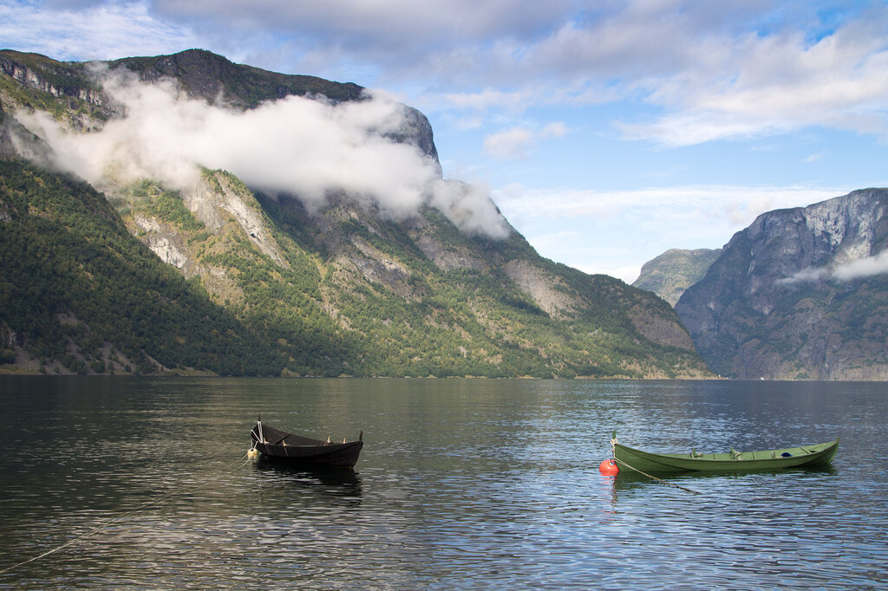

Еще он вручил нам визитки, на котором был написан адрес его сайта.. Тут не то что [юзабилити-специалист](http://uxman.ru/) посмеется, а любой, кто попробует вбить это в адресную строку: [http://www.aurlandfjordogfjellguiding.com](http://www.aurlandfjordogfjellguiding.com/)

На каяках мы поплавали по самому большому в мире фьорду - Согнефьорду (Sognefjorden). Из звуков были только звуки птиц, наших весел и проплывающих вдалеке лодок. Нам невероятно повезло с погодой - на море был штиль, небо солнечное и было даже почти жарко.

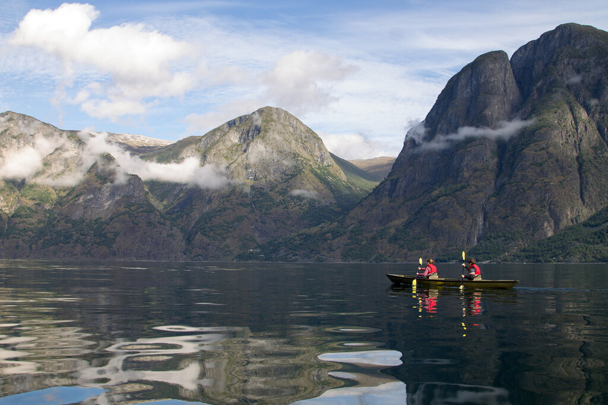

Кстати, вода там не такая соленая, как в открытом море. Скорее всего из-за множества пресных источников воды - горных речушек, тут и там спадающих с отвесных скал.

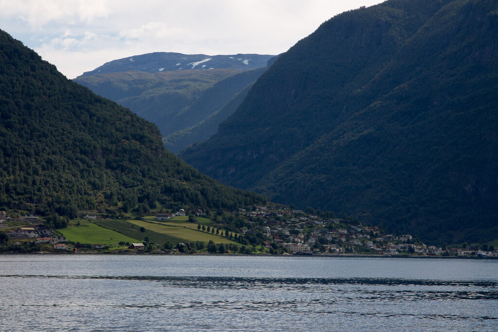

Небольшой видеорепортаж с места событий.

<iframe src="//www.youtube.com/embed/Q4kfMllLA8A?rel=0" width="640" height="480" frameborder="0" allowfullscreen="allowfullscreen"></iframe>

На противоположном берегу мы нашли единственный заброшенный дом в Норвегии. Вокруг него были заросли дикой крапивы и малинник со спелыми ягодами (в сентябре!).

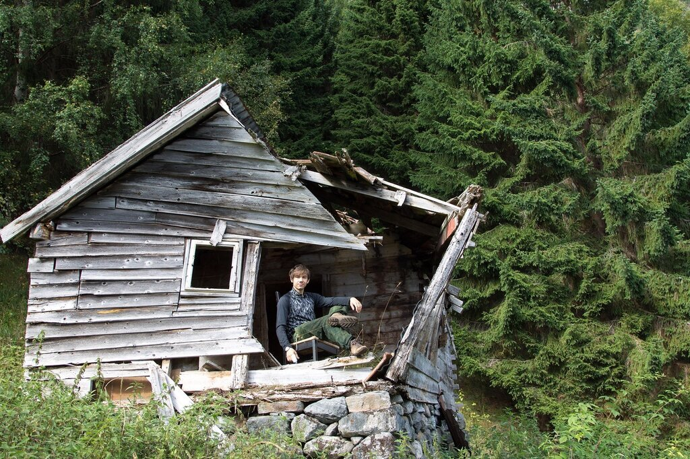

На суше мы сняли всю верхнюю одежду - она в той или иной степени была мокрой (веслами мы обрызгивали друг друга) и пообедали, пока она сохла на солнышке.

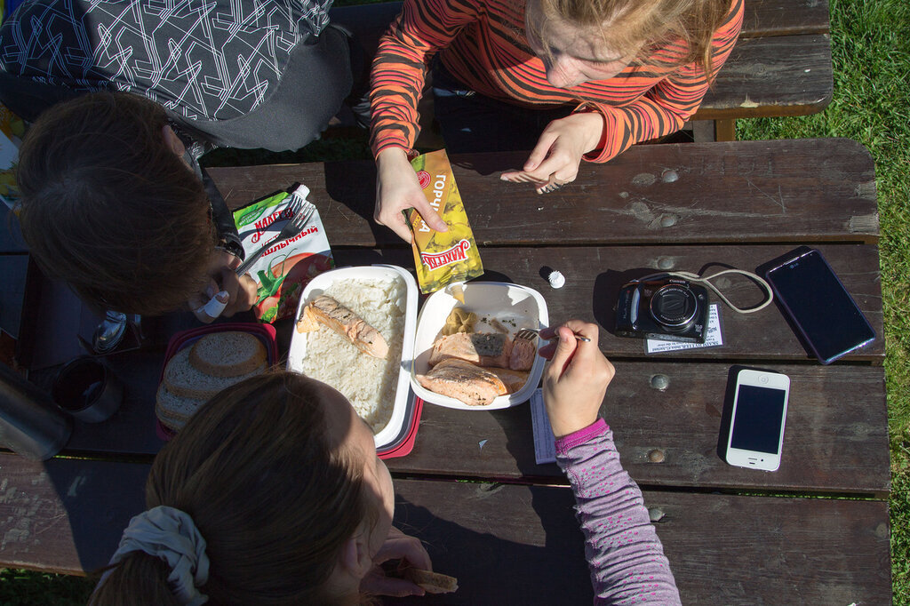

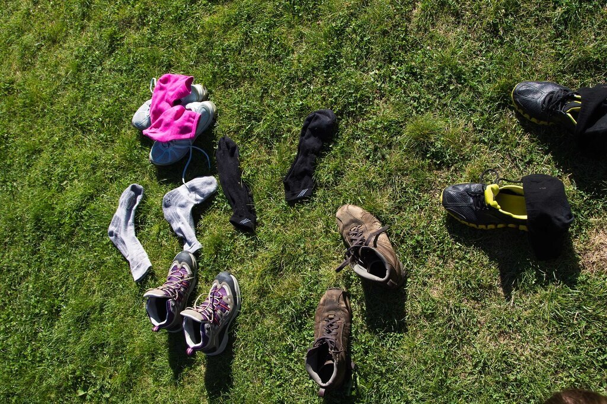

А кто-то вместо обеда запускал воздушного змея и остался голодным.

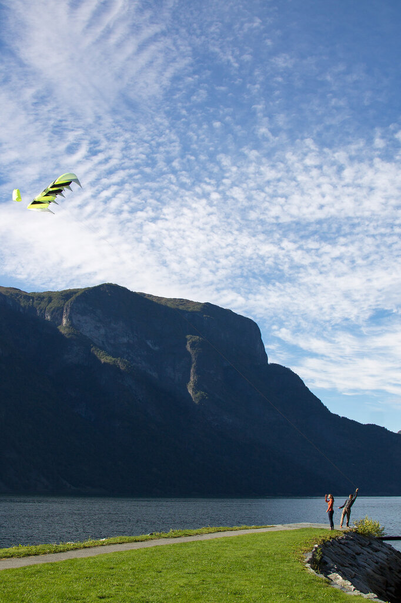

Мы провели замечательный день на природе и катастрофически опоздали на ночевку в Ставангер к моим знакомым, которые уже два года живут в Норвегии и,  несмотря на поздний час, встретили  и проговорили с нами почти до утра.

До Ставангера, рядом с которым находится знаменитый Прекестулен, очень удобно добираться из Осло - всего 50 минут полета. По авиабилетам можете примерно сориентироваться тут:

или сходите на [Aviasales](http://www.aviasales.ru/?marker=25257) или Skyscanner.

Читайте все части нашей истории о Норвегии:

- [В Норвегию на машине. Часть 1. Подготовка к поездке](https://vodpop.ru/v-norvegiju-na-mashine-podgotovka/ "В Норвегию на машине. Часть 1. Подготовка к поездке")
- [В Норвегию на машине. Часть 2. Начало пути](https://vodpop.ru/moskva-norvegija-na-mashine/ "В Норвегию на машине. Часть 2. Начало пути")
- [В Норвегию на машине. Часть 3. Нордкап и Лофотенские острова](https://vodpop.ru/nordcap-i-lofotenskie-ostrova/ "В Норвегию на машине. Часть 3. Нордкап и Лофотенские острова")
- [В Норвегию на машине. Часть 4. Тропа Троллей и Атлантическая дорога](https://vodpop.ru/atlanticheskaja-doroga/ "В Норвегию на машине. Часть 4. Тропа Троллей и Атлантическая дорога")
- [В Норвегию на машине. Часть 5. Ставангер и Прекестулен](https://vodpop.ru/stavanger-prekestulen/ "В Норвегию на машине. Часть 5. Ставангер и Прекестулен")
- [В Норвегию на машине. Часть 6. Осло и Стокгольм](https://vodpop.ru/oslo-stokholm/ "В Норвегию на машине. Часть 6. Осло и Стокгольм")

Возможно, вам также будут интересны статьи о наших других поездках на машине по северным странам:

- [Исландия на машине зимой](https://vodpop.ru/category/evropa/islandiya/)
- [Вся Великобритания на машине](https://vodpop.ru/category/evropa/velikobritaniya/)
