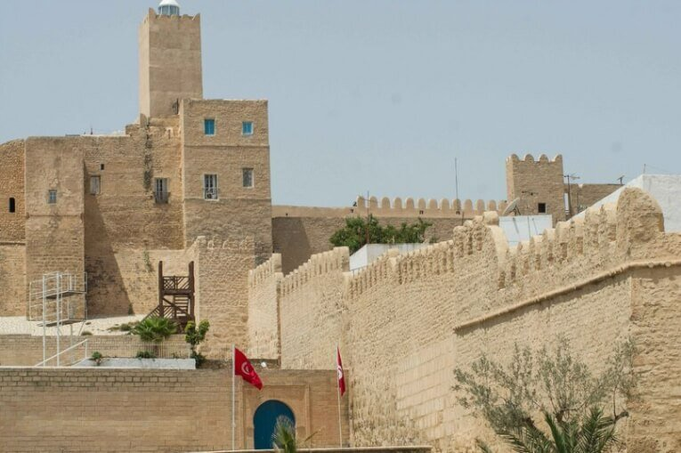

Наткнувшись на фото прошлого года, я решила написать о наших впечатлениях от поездки в Тунис в июле 2012 года.

<!--more-->

Эта поездка была первой (и последней), в которую мы поехали через турагенство. Получилось так потому, что вконец умотавшись после сдачи сессии и работы, мы решили взять 3 дня перерыва и уехать куда-нибудь к морю. Конечно, в июле проще поехать куда-то на неделю, а то и на две, ведь самое дорогое это перелет. Увы, двух недель или даже  недели у нас в распоряжении не было. Поэтому мы не задумываясь купили за 20 тыс. рублей тур на 3 дня. У нас было главное пожелание - чистое море. И оно сбылось на все 100.

Аэропорт в Тунисе, откуда нас забрали представители Elite Travel, чтобы отвезти до отеля в городе Монастир, что находится в 2 часах езды.

Нас встретил добродушный тунисец, свободно говорящий по-русски. А вот водитель говорил по-арабски и только по телефону. Выглядел очень сосредоточенно.  Учитывая манеру вождения всех арабов без исключения, я могу понять его озабоченное выражение лица.

Типичный Тунис. Вид из окна.

Вид из нашего номера в Hotel Les Palmiers Beach Holiday Village, Монастир. На пляже довольно людно. Хотя утром и вечером он был почти пустой.

С такого расстояния, конечно, не видно,что пляж из идеального белого песка, с абсолютно чистой и кристально прозрачной водой. Но несмотря на такое море, в отеле всегда найдутся любители поплавать в хлорированном бассейне. Просто удивительно!

Номера в отеле довольно приятные - светлые и просторные. На кровать каждый день клали вкусно пахнущие живые цветочки.

Хотя сам отель (по совокупности впечатлений) оставлял желать лучшего - завтраки были так себе, а на обед можно было заказать только пиццу. Но за такую цену в сезон, да еще учитывая, что мы просили подобрать нам все это в последний момент, это было абсолютно нормально.

Мы очень пожалели, что не попали на двухдневный тур в пустыню Сахару. Это то единственное, зачем мы хотим когда-нибудь вернуться в Тунис. Маршрут путешествия представляет собой огромную «петлю» протяженностью 1300 км и захватывает почти две трети страны. Бескрайние оливковые плантации, степи, полупустыни и пустыни, соленые озера, горы, оазисы, каньоны. Единственное "но" - турагенства предлагают проделать этот маршрут на кондиционированном автобусе. Но куда интереснее это проделать на джипах, с местным гидом. "Больше треша", как любит говорить Климентий.

Мы решили не засиживаться в отеле и отправились изучать местность в округе. Сначала мы нашли в паре километров тихое место, где можно поплавать в одиночестве. Дно там не такое белоснежное, как возле отеля, но вода такая же чистая.

Затем мы решили съездить в сам город. Монастир - это рыболовный порт,а также родной город 1-го президента Туниса Хабиба Бургибы, где расположен его мавзолей.

Исторической достопримечательностью Монастира являются руины крепости Рабат Хартема, которая была возведена генералом Хартемом ибн Аюном в 796 году. После из его частей была построена крепость-касба, откуда открывается вид на большое кладбище Кубу, которое пользуется огромным почетом у мусульман. Есть поверье, что там исцеляются больные.

На главной площади, ведущей к мавзолею, продавцы активно пытаются что-то нам впихнуть "всего за один динар", причем по-русски. Чересчур навязчивый сервис. От торговца платками-арафатками в буквальном смысле пришлось убегать. Единственное, что мы купили - блюдо с красивым этническим орнаментом, в подарок маме Климентия. Покупка прошла легко только потому, что продавца в момент нашего выбора просто не было в магазине: он пришел позже и сразу пытался что-то навязать. Мы быстро расплатились и убежали.

А вот и младшее поколение торгашей подрастает.

На следующий день мы решили поехать в Сус (Sousse) - морской порт в Тунисе, известный своими достопримечательностями. Одной из них является укрепленная крепость-монастырь Рибат,  одна из самых древних крепостей Туниса. Она была окончательно достроена в 821 году н.э.

Нравится статья? Узнавайте первым о выходе новых интересных историй! Подпишитесь на нас по [эл. почте](http://feedburner.google.com/fb/a/mailverify?uri=vodpop&loc=ru_RU) или в [группе ВКонтакте](http://vk.com/vodpop)

Карта старого города

Типичные улочки Суса выглядят именно так. К счастью, их запах передать невозможно. Женщины таскают столы

В то время, как мужчины сидят и отдыхают на скамейках

Восток, конечно, дело тонкое. Но я бы и дня не выдержала тут жить.

На улицах одни мужчины.

Разные

Временами счастливые

Временами не очень

Нагулявшись по городу, мы решили вернуться в Монастир. К метро пробирались закоулками.

Тут и там продавали багеты и сладости. Чувствуется влияние Франции

Хотя по части выпечки тунисцы не сильны. Вкус очень странный, на любителя, но выбор очень хороший. Может, нам просто не повезло.

Кстати, в пекарнях работают только женщины. Интересно, почему?

Тут и там кафешки заманивают на кус-кус. Но запахи города отбивают весь аппетит.

Мы с трудом запихиваем в себя по половине мороженого, чтобы не рухнуть без сил, пока идем пешком до станции метро Sousse Ville, откуда идут поезда в Монастир. Путь до Монастира занимает 30 минут. Поезда отправляются каждые 40-50 минут. Внутри поездов ходят кондукторы, которые проверяют и компостируют билеты. У них также можно купить билет, если ты зашел на станции, на которой нет кассы. В вагоне очень свежо и чисто.

За окном нам открывались потрясающие виды, но уморенным жарой и запахами, нам было лень даже пошевелить пальцем. Поэтому приехав в отель, мы приняли душ и стали ждать нашего доброжелательного сопровождающего, чтобы добраться до аэропорта Туниса.

По дороге мы заехали на заправку, где купили печеньки "Tuc Tuc", одни из самых маньячно-вкусных из тех, что продаются в России. Каково же было мое разочарование, когда вместо вкусного сырного крекера в пачке оказалось совершенно невнятное месиво, лишь отдаленно напоминающее печенье с сыром.

Пожалуй, в этом выражается весь Тунис - бедная страна, с массой экономических и социальных проблем, которая привлекает туристов своей дешевизной. Возможно, сейчас (после Азии) мы бы восприняли это легче, но тогда нам показалось, что нет ничего хуже бедной арабской страны, в котором женщины выглядят абсолютно несчастными: с двумя-тремя детьми наперевес с сумками, одетые в темную ткань с ног до головы, да и мужчинам приходится не сладко - ведь им нужно кормить огромную семью, вот они бегают и впихивают туристам платки за 1 динар.

Несмотря на то, что страна нам категорически не понравилась, было интересно посмотреть на другую культуру и искупаться в потрясающе чистом море. И первый раз мы возвращались в Россию с неподдельным восторгом и гордостью за свою страну. Все познается в сравнении.

