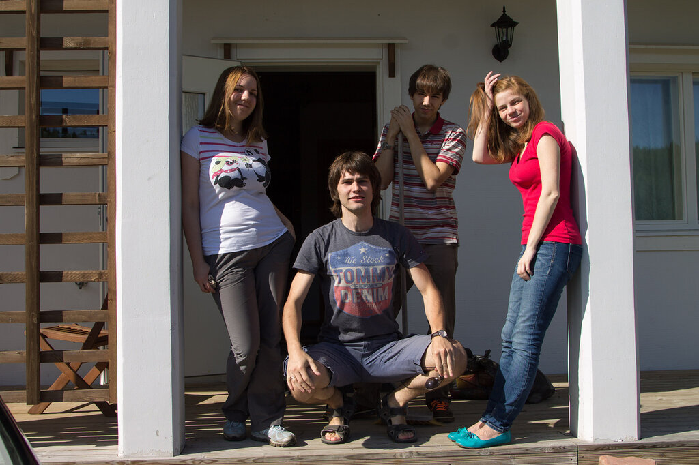
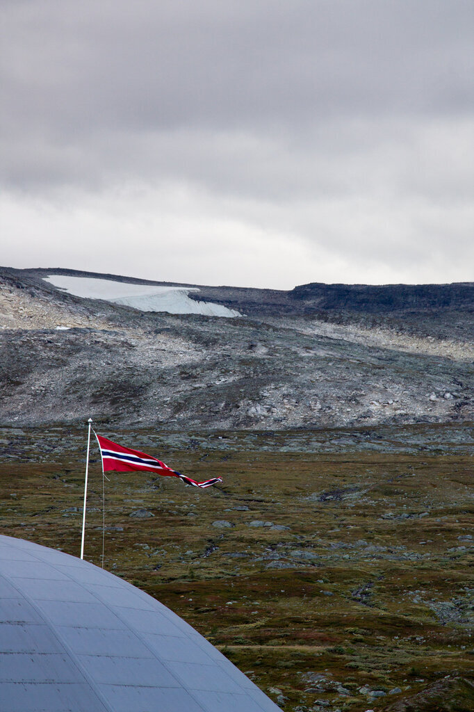
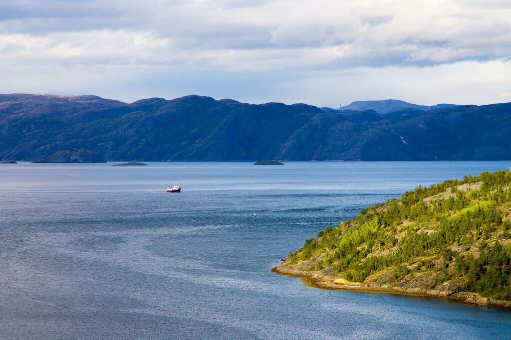
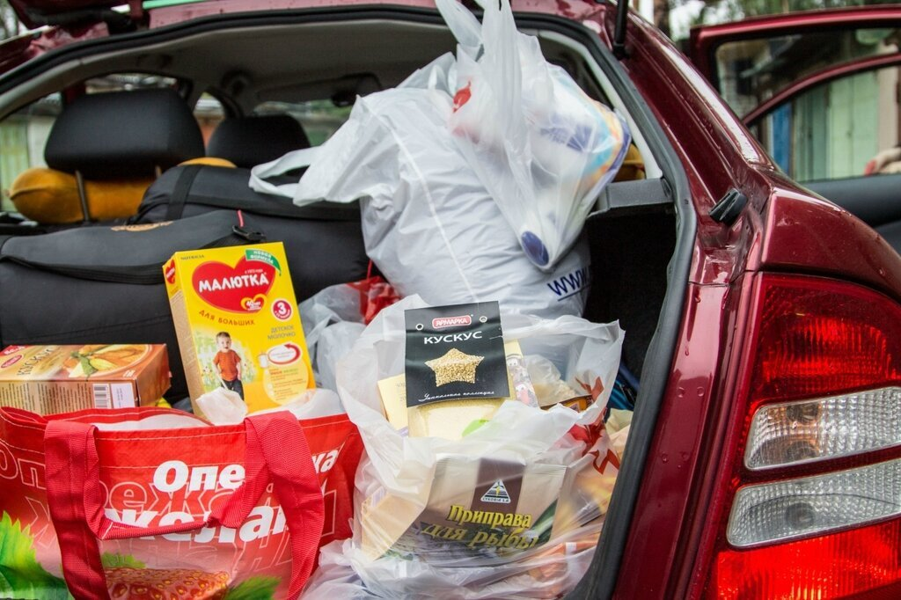
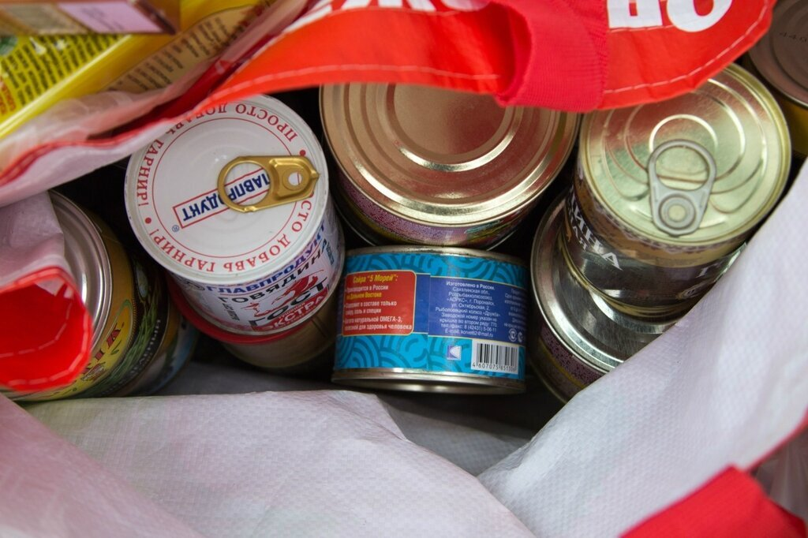
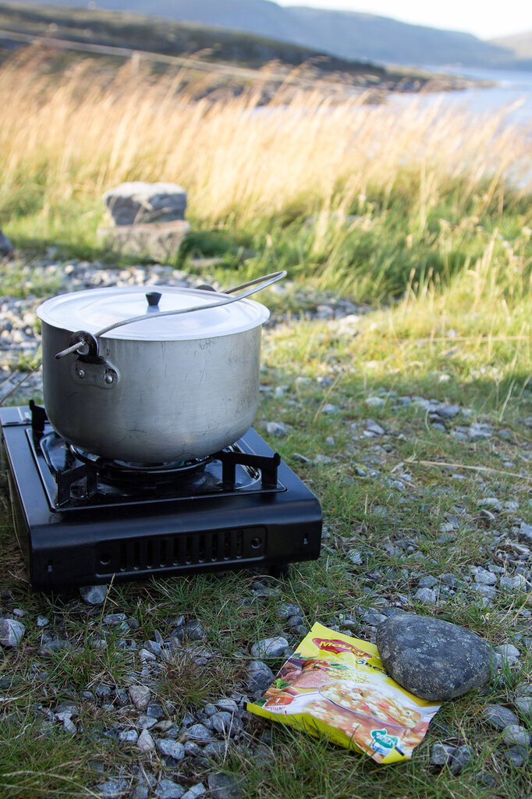
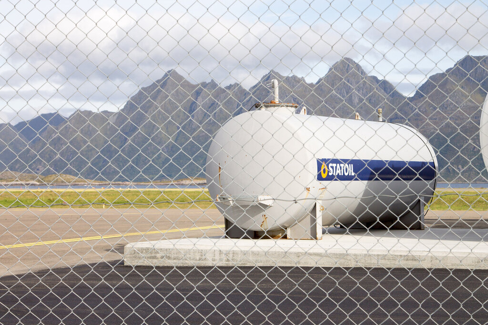
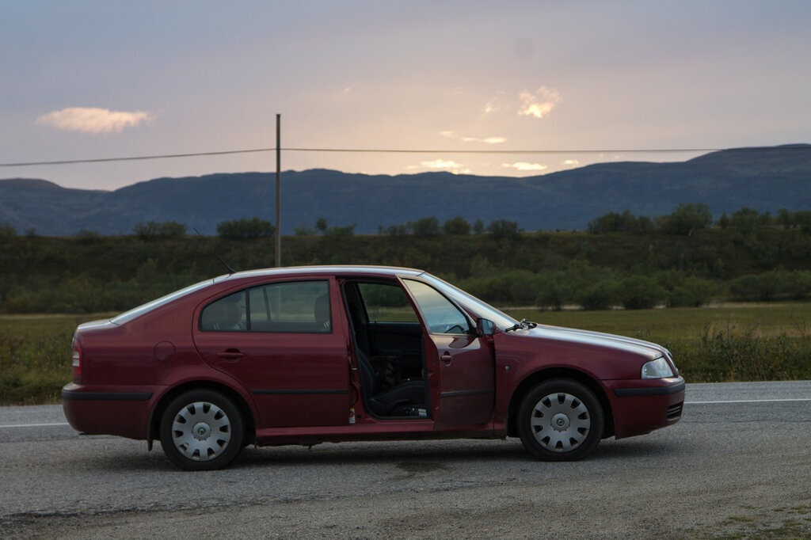
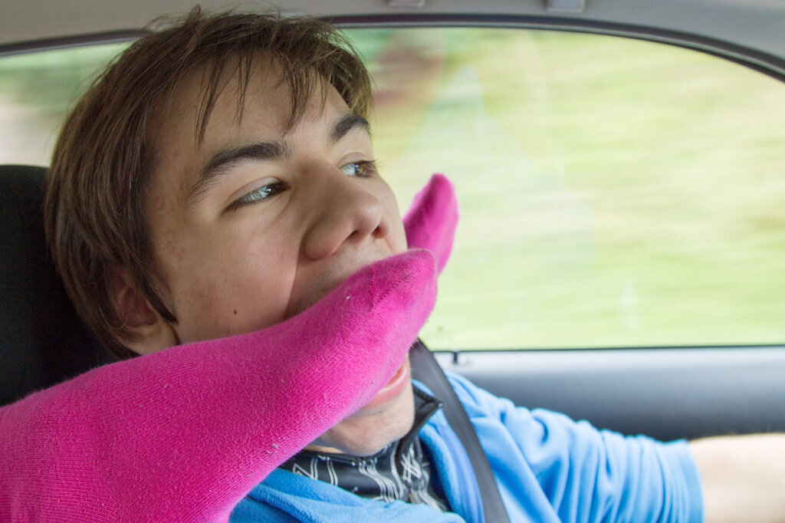
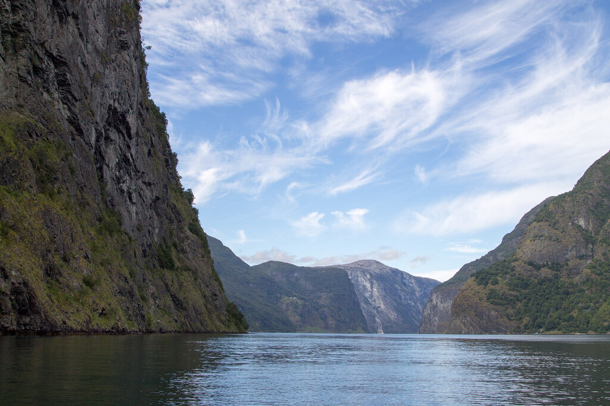

Путешествие в Норвегию на машине мы планировали за 3 месяца. Уехать раньше никак не получалось - защита и вручение дипломов, поток заказов по работе, поездка в Самару к моим родным, а еще нужно было подстроиться под отпуск друзей, с которыми мы собирались путешествовать - Владимира и Даши.

<!--more-->

Читайте все части нашей истории о Норвегии:

- [В Норвегию на машине. Часть 2. Начало пути](https://vodpop.ru/moskva-norvegija-na-mashine/ "В Норвегию на машине. Часть 2. Начало пути")
- [В Норвегию на машине. Часть 3. Нордкап и Лофотенские острова](https://vodpop.ru/nordcap-i-lofotenskie-ostrova/ "В Норвегию на машине. Часть 3. Нордкап и Лофотенские острова")
- [В Норвегию на машине. Часть 4. Тропа Троллей и Атлантическая дорога](https://vodpop.ru/atlanticheskaja-doroga/ "В Норвегию на машине. Часть 4. Тропа Троллей и Атлантическая дорога")
- [В Норвегию на машине. Часть 5. Ставангер и Прекестулен](https://vodpop.ru/stavanger-prekestulen/ "В Норвегию на машине. Часть 5. Ставангер и Прекестулен")
- [В Норвегию на машине. Часть 6. Осло и Стокгольм](https://vodpop.ru/oslo-stokholm/ "В Норвегию на машине. Часть 6. Осло и Стокгольм")

Возможно, вам также будут интересны статьи о наших других поездках на машине по северным странам:

- [Исландия на машине зимой](https://vodpop.ru/category/evropa/islandiya/)
- [Вся Великобритания на машине](https://vodpop.ru/category/evropa/velikobritaniya/)

Подготовились мы довольно основательно, прочитав огромное количество блогов и статей. Оказалось, что Норвегия далеко не самое популярное место самостоятельных путешествий на машине среди русских туристов. Уверена, что большинство отпугивают невероятно высокие цены на все - еду, бензин, жилье.

Я постараюсь рассказать, как бюджетно съездить в Норвегию и получить массу ярких впечатлений, которые останутся на всю жизнь.

## Маршрут

Начать нужно с составления маршрута. Определиться, каким составом мы поедете, какие у вас интересы - природа, рыбалка, каякинг, музеи - в Норвегии есть все, главное - решить, что же подходит именно вам. Наш [первоначальный маршрут](https://docs.google.com/document/d/12KV_ON7CXNhDOSitgdG7GAxihQq6C0hDlmnzq96F764/edit "Готовый маршрут в Норвегию") немного изменился в ходе поездки, но вы можете его взять за основу вашего самостоятельного путешествия. 

Мой самый главный помощник  был официальный сайт Норвегии [http://www.visitnorway.com/ru](http://www.visitnorway.com/ru) - здесь есть вся необходимая информация о развлечениях, достопримечательностях, транспорте, еде и жилье во всех городах Норвегии без исключения.

Отели и кемпинги на первые дней 5 мы бронировали заранее. Больше всего предложений по Норвегии представлено на [Booking.com](http://www.booking.com/country/no.ru.html?aid=878635;sid=218c686841c262f02445a59c97f28c50;dcid=4;hide_ss=1&), однако стремительно набирает популярность сервис для аренды жилья у местных - Airbnb (для наших читателей - [ссылка на скидку 2100 рублей](http://www.airbnb.ru/c/alexandrab4058) при первом бронировании).

## Визы

У нас с Климентием уже есть французские годовые визы. А друзья оформили шенгенскую визу в Финляндию без каких-либо проблем (по стране первого въезда). Визы в Норвегию , по слухам, делаются сложнее. Вот [тут](http://www.finland.org.ru/public/default.aspx?nodeid=42712&contentlan=15&culture=ru-RU "Оформить визу в Финляндию") можно посмотреть всю необходимую информацию про получение визы в Финляндию.

Кстати, в последнее время набирают популярность различные [автоматизированные сервисы](http://c5.travelpayouts.com/click?shmarker=25257&promo_id=125&source_type=link&type=click), через которых можно в удобном интерфейсе заполнить анкету и потом получить визу с доставкой на дом. Мы пока не пробовали, но я верю, за этим будущее. Если попробуйте — будет здорово, если поделитесь впечатлениями в комментариях.

## Страховки

Мы с мужем заядлые путешественники, и неоднократно пользовались услугами страховой в поездках. Последние годы мы покупаем страховку компании Либерти на [страховом агрегаторе Черехапа](http://c24.travelpayouts.com/click?shmarker=25257&promo_id=519&source_type=link&type=click). Это позволяет сэкономить время на выборе страхового полиса.

Кроме гарантий самой страховой и ассистанса, Черехапа также следит за выполнением обязательств по страховке, и в случае чего могут помочь. 

## Что взять с собой?

Ответ на этот вопрос индивидуален для каждого. Есть [список вещей](https://docs.google.com/spreadsheet/ccc?key=0An_6mm0BXFgFdGY2X0pQUGlSVkZ5OW14cDZaTkVidWc#gid=0 "Список вещей в Норвегию"), который мы составили для себя. И не забудьте теплые вещи, если собираетесь поехать на север Норвегии!

Узнав про цены на еду в Норвегии, мы решили купить все необходимое в Москве. Консервы, макароны, соусы, печеньки и шоколадки еле уместились в 2 сумки по 25 кг, но к окончанию поездки съели почти все подчистую. Наш [список продуктов](https://docs.google.com/spreadsheet/ccc?key=0An_6mm0BXFgFdG1EbnpZcUJmUXllTWhLbUVkaUpFWHc#gid=0 "Список продуктов в Норвегию") также доступен для ознакомления и скачивания.

Наличие еды с собой позволило здорово сэкономить, хотя мы покупали и местные продукты - макароны, рыбу, молоко, йогурты. В среднем цены выше российских в 2-2,5 раза. Алкоголь настоятельно советую везти с собой (если он вам нужен) - покупать в Норвегии очень дорого.

Готовить в дороге можно с помощью плитки на газовом баллоне. У нас уже была своя, но ее можно купить почти в каждом крупном магазине (мы видели в супермаркете "Лента" за 800 рублей. Баллон от 50 до 90 рублей). Мы кипятили чай и варили суп. Довольно удобно.

## Деньги

Если в Финляндии вы еще можете встретить надпись cash only  (только наличные), то Норвегия - страна, в которой абсолютно везде можно заплатить карточкой, будь то паромы, кемпинги, супермаркеты, музеи и т.п..

Карты принимают все без исключения, мы  платили одной картой MasterCard Сбербанка. Наличные нам потребовались только 1 раз - расплатиться за аренду каяка и домика на Согнефьорде. Проблем не возникло - банкоматы есть в каждом городе. 

Валюта Финляндии - евро, валюта Норвегии - норвежская крона. Для простоты подсчета 1 евро=10NOK.

## Бензин

Одна из самых высоких цен в мире на нефтепродукты. Довольно странно, учитывая, что Норвегия входит в тройку ведущих стран по объемам добычи нефти. Объясняют они это созданием Стабилизационного Фонда для будущих поколений и заботой об окружающей среде. Поэтому литр бензина в Норвегии стоит 16NOK.

## На чем ехать

Мы выбрали вариант с собственным автомобилем - Шкода Октавиа Тур. Так намного интереснее, плюс можно посмотреть несколько стран "по дороге".  Однако тем, кто не фанатеет от длинных перегонов по 500-900 км рекомендую либо лететь самолетом и  брать машину в аренду, либо увеличивать количество дней отпуска, чтобы без спешки проезжать по 200-300 км в день.

Мы обычно бронируем один из самых дешевых вариантов, доступных среди международных прокатных контор. По Европе, как правило, больше всего компаний представлено на [Rentalcars.com](http://c13.travelpayouts.com/click?shmarker=25257&promo_id=653&source_type=customlink&type=click&custom_url=http%3A%2F%2Fwww.rentalcars.com%2F%3FaffiliateCode%3Dwendatravel%23country%3D%D0%9D%D0%BE%D1%80%D0%B2%D0%B5%D0%B3%D0%B8%D1%8F%26city%3D%D0%9E%D1%81%D0%BB%D0%BE%26location%3D0%26puSameAsDo%3Don%26dropCountry%3D%D0%9D%D0%BE%D1%80%D0%B2%D0%B5%D0%B3%D0%B8%D1%8F%26dropCity%3D%D0%9E%D1%81%D0%BB%D0%BE%26dropLocation%3D0%26puHour%3D10%26puMinute%3D0%26doHour%3D10%26doMinute%3D0%26puDay%3D15%26puMonth%3D11%26puYear%3D2015%26doDay%3D18%26doMonth%3D11%26doYear%3D2015%26enabler%3D%26driverage%3Don%26driversAge%3D25%26locationName%3D%D0%92%D1%8B%D0%B1%D0%B5%D1%80%D0%B8%D1%82%D0%B5%26dropLocationName%3D%D0%92%D1%8B%D0%B1%D0%B5%D1%80%D0%B8%D1%82%D0%B5%26searchType%3D%26doFiltering%3Dfalse%26filterFrom%3D0%26filterTo%3D1000%26countryCode%3D%26dropCountryCode%3D%26emptySearchResults%3Dtrue), да и техподдержка у них очень вежливая и готова помогать и разбираться.

По авиабилетам можете примерно сориентироваться тут:

или сходите на [Aviasales](http://www.aviasales.ru/?marker=25257) или Skyscanner.

Мы точно знаем, что [авиабилеты можно купить очень дешево](https://vodpop.ru/kak-kupit-samyie-deshevyie-aviabiletyi/).

В Финляндии и Норвегии водителя нельзя отвлекать (!) - ему нужно быть очень аккуратным, чтобы вовремя заметить оленей или овец, выбегающих на дорогу.

Особенно советую ознакомиться с [ПДД Норвегии](http://www.visitnorway.com/ru/About-Norway/Safety-first/Driving-in-Norway/ "Правила дорожного движения в Норвегии") - они очень строгие. Нарушителям выписывают огромные штрафы (например, мы в Осло "припарковались" на 500NOK.

Зато за счет соблюдения скоростного режима 50/80 - по городу/вне города, машина потребляет минимальное количество бензина. Наш лучший показатель 6,5 литров на 100 км (4 человека+ 500 литров багажника, забитых под завязку). Насчет международных прав мы так и не поняли - нужны они или нет. У нас было 3 водителя и все с российскими правами.

Отдельно скажу про платные дороги - мы платили только там, где была "мануальная оплата" - т.е. сидел человек и принимал карточки. В остальных случаях стояли "automatic toll", которые можно игнорировать. Полицию на дороге мы видели только один единственный раз, перед въездом в тоннель.

## Стоимость поездки

Мне кажется, что мы обошлись минимальными тратами, хотя сильно себе ни в чем не отказывали - посмотрели и сделали все, что запланировали (кроме рыбалки - был не сезон).

Мы проссуммировали все затраты на поездку (на 4 человек) и подвели итог по статьям:

1. Бензин - 954€;
2. Еда - 415€;
3. Жилье -954€;
4. Платные дороги и паромы - 375€;
5. Прочее - 81€

Получилось примерно по 700€ с человека за 16 дней отдыха, что совсем недорого, учитывая уровень цен в Норвегии.

Если у вас остались какие-либо вопросы - пишите, мы обязательно ответим!

Читайте все части нашей истории о Норвегии:

- [В Норвегию на машине. Часть 1. Подготовка к поездке](https://vodpop.ru/v-norvegiju-na-mashine-podgotovka/ "В Норвегию на машине. Часть 1. Подготовка к поездке")
- [В Норвегию на машине. Часть 2. Начало пути](https://vodpop.ru/moskva-norvegija-na-mashine/ "В Норвегию на машине. Часть 2. Начало пути")
- [В Норвегию на машине. Часть 3. Нордкап и Лофотенские острова](https://vodpop.ru/nordcap-i-lofotenskie-ostrova/ "В Норвегию на машине. Часть 3. Нордкап и Лофотенские острова")
- [В Норвегию на машине. Часть 4. Тропа Троллей и Атлантическая дорога](https://vodpop.ru/atlanticheskaja-doroga/ "В Норвегию на машине. Часть 4. Тропа Троллей и Атлантическая дорога")
- [В Норвегию на машине. Часть 5. Ставангер и Прекестулен](https://vodpop.ru/stavanger-prekestulen/ "В Норвегию на машине. Часть 5. Ставангер и Прекестулен")
- [В Норвегию на машине. Часть 6. Осло и Стокгольм](https://vodpop.ru/oslo-stokholm/ "В Норвегию на машине. Часть 6. Осло и Стокгольм")

Возможно, вам также будут интересны статьи о наших других поездках на машине по северным странам:

- [Исландия на машине зимой](https://vodpop.ru/category/evropa/islandiya/)
- [Вся Великобритания на машине](https://vodpop.ru/category/evropa/velikobritaniya/)
