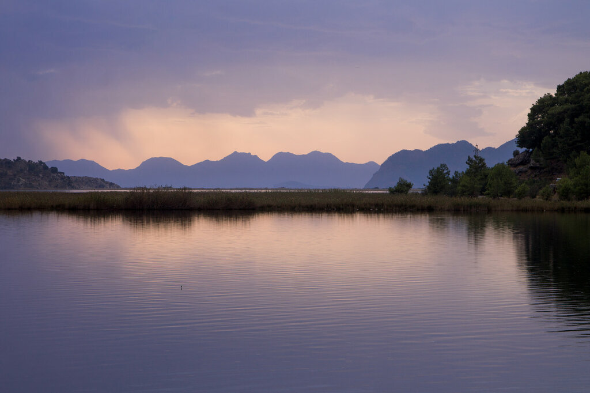
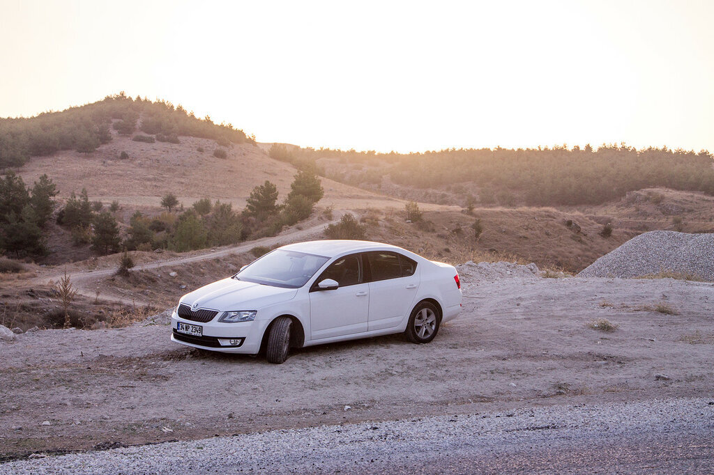
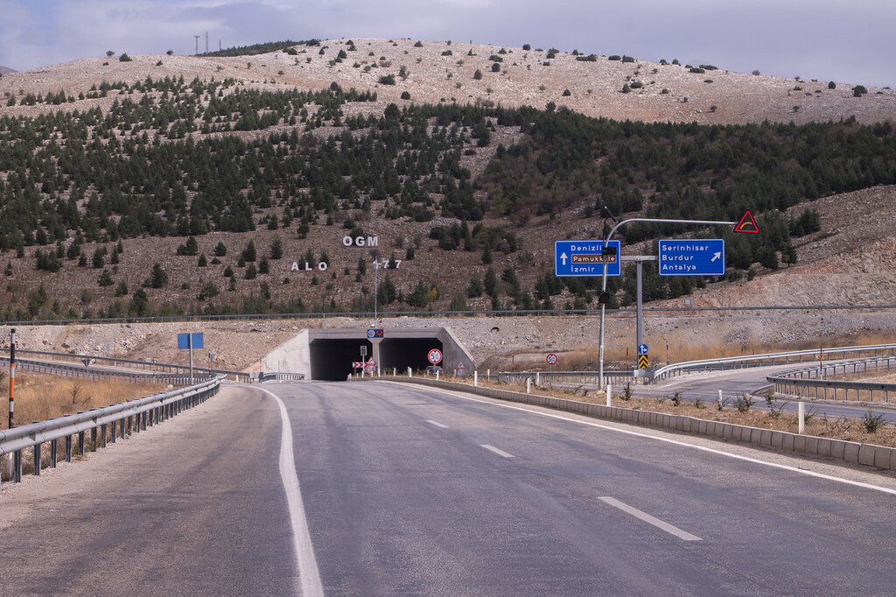
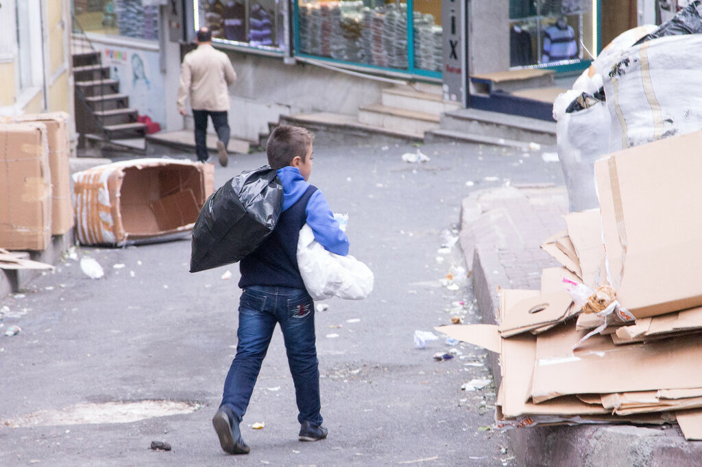
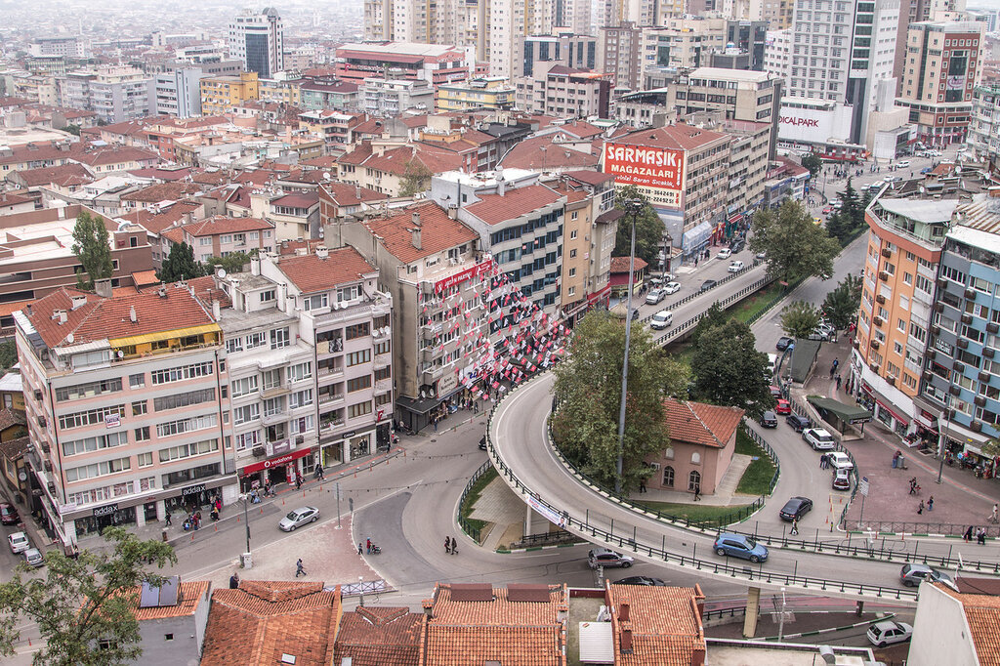
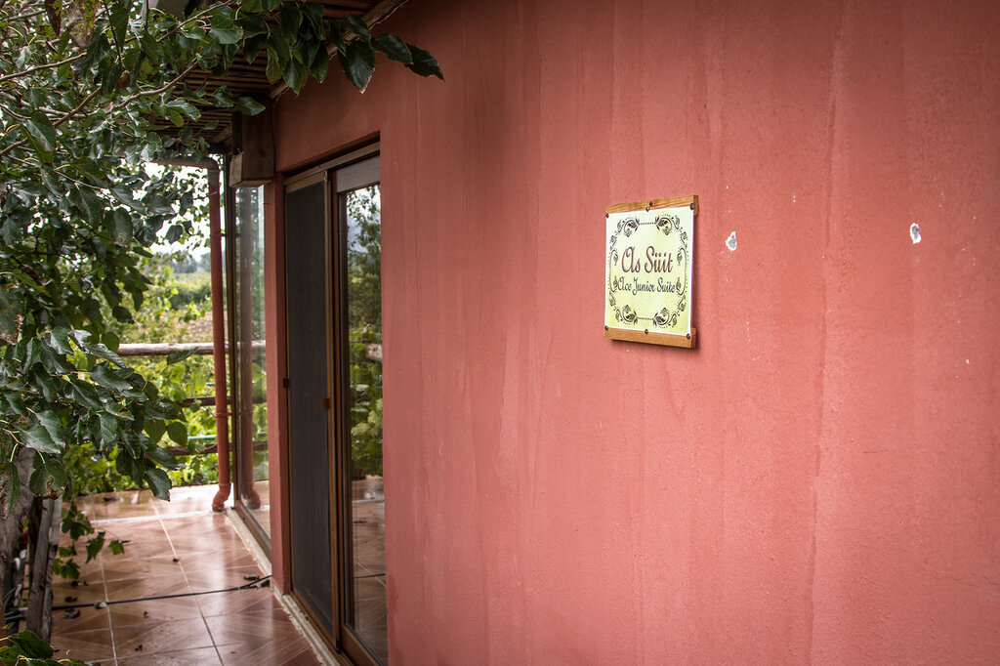

Возможно, вам приелись популярные пакетные предложения в Кемер-Анталию, или же вы устали видеть загорелые и улыбчивые лица своих соотечественников, или же вы просто хотите увидеть "другую" Турцию и ищете ответ, как подготовиться к поездке. Если ответ на любой из вопросов "да", то оставайтесь с нами.

<!--more-->

## **Шаг первый.** Покупка билетов в Турцию.

Начать подготовку к поездке в Турцию стоит с поиска авиабилетов. Мы уже рассказывали вам, [как купить дешевые билеты](https://vodpop.ru/kak-kupit-samyie-deshevyie-aviabiletyi/), поэтому пропустим эту часть. На наши даты в октябре самыми дешевыми были билеты со стыковкой в Кишиневе.

В аэропорту можно перекусить в кафе, воспользоваться бесплатным wi-fi и набраться сил для дальнейшего отдыха.

## **Шаг второй. А**ренда машины в Турции.

Большинство машин в Турции дизельные, т.к. бензин очень дорогой, и в прокатных конторах почти невозможно встретить недизельную машинку. На всякий случай уточните, когда будете арендовать.

Также советую арендовать белый или серебристый автомобиль - он будет меньше нагреваться на солнце. Некоторые сразу покупают светоотражающий коврик под лобовое стекло, но мы не увидели в нем нужды. А вот очки с хорошими UV-фильтрами вам точно пригодятся.

Увы,  несмотря на огромную популярность услуги по прокату авто по всему миру, до сих пор не доведена до совершенства. Первоначальный поиск по параметрам и ценам сделан с умом, но процесс постоянно затыкается на людях, которые оформляют документы на месте: они сканируют паспорт, заносят руками номера прав и выполняют кучу мануальных действий, которых, по идее, вообще не должно быть, ведь мы бронируем машинку заранее и поля заполняем тоже заранее. Однако в среднем в прокатной конторе нужно провести около 40 минут, чтобы наконец получить ключи от заветной машинки.

[Мы бронировали](http://<a target="_blank" href="http://c13.travelpayouts.com/click?shmarker=25257&promo_id=529&source_type=link&type=click">Аренда автомобилей \(Автоматическое определение языка\)</a>) класс Ford Mondeo или аналог: нам предложили Nissan Qashqai, но мы не фанаты данной машины и попросили поискать что-нибудь еще. Все происходило так медленно, что мы уже согласились бы и на Qashqai, но тут турок сказал, что дать нам его не может: Климу еще нет 27, и согласно их законам, он не может управлять SUV-классом.

Далее была Skoda Octavia 2015 года, от которой хотела отказаться уже я, так как у нас у самих такая же модель Skoda, только постарше. Однако других машинок в наличии не было, поэтому мы согласились, и пока по прошествии двух дней еще не пожалели. Инженеры Skoda хорошенько поработали над ходовыми характеристиками : с дизельным двигателем 1.6 она вполне сделает нашу бензиновую 1.8. Дизайн внутри тоже поменялся, и самым неприятным открытием стал пластик над спидометром - он такой же гнущийся, как и в новом Ford Focus. Зато все остальное выглядит и ощущается вполне приятно. Теперь тут хорошие сиденья с боковой поддержкой, что не может не радовать: в машине предстоит проехать 2500 км.

Первое впечатление от Стамбула мы получили еще в аэропорту - это Азия!

Как только мы выехали на местную кольцевую , сразу получили второе: это Москва!

Безумные, совершенно безумные пробки, в которых ползешь со скоростью 20 км/ч.

Несмотря на желание встретиться с нашими знакомыми путешественниками, которые так же в эти даты оказались в Стамбуле, мы решили, что нам не стоит въезжать в город, и мы сразу сделали марш-бросок через Гебзе в Бурсу.

**Шаг третий** - забронировать гостиницы. Мы чаще всего используем [booking.com](http://www.booking.com/searchresults.ru.html?city=-755070&aid=878635).

На первую ночь всем и вся я рекомендую бронировать ночевку заранее - так вы избежите лишних переживаний и проблем после перелета и непривычной атмосферы. Однако следовать мудрым советам - не наша стезя: слишком уж мы любим чувство свободы, чтобы определиться хотя бы с гостиницей. Клим никогда не разрешает букать заранее, т.к. в любой момент мы можем захотеть ускориться/замедлиться или вообще отклониться от маршрута.

В результате на подъезде в Бурсе мы нашли гостиницу 5\*, в котором нам дали воспользоваться wi-fi, забронировали другую гостиницу (в два раза дешевле и без звездочек) и отправились туда на ночевку.

О впечатлениях о Турции читайте в следующих статьях.
