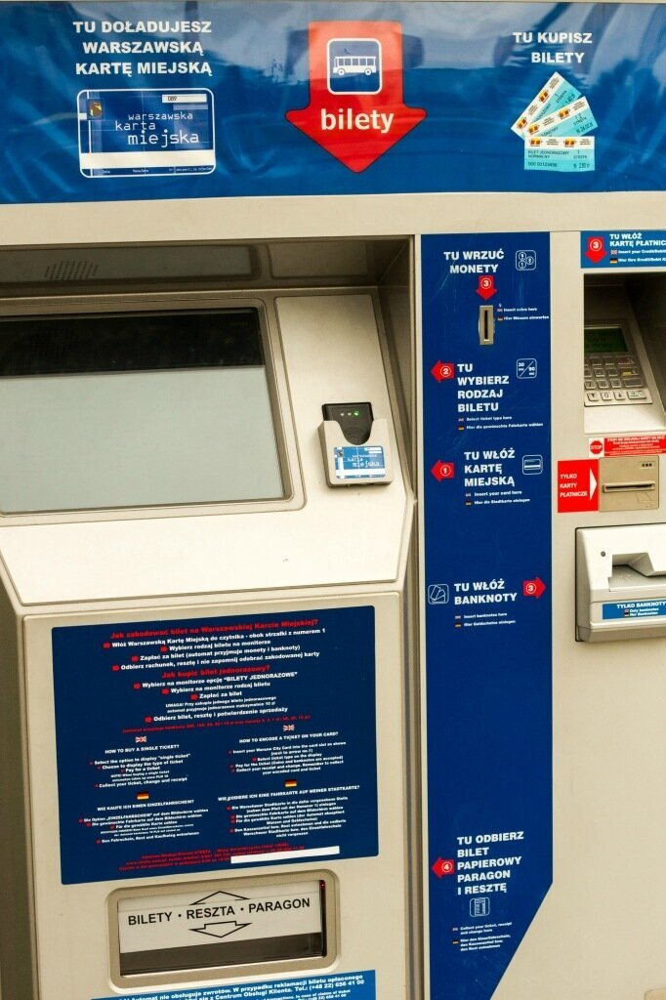
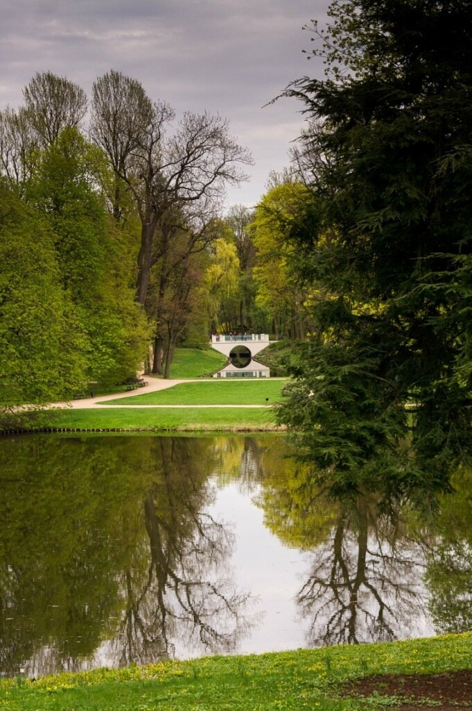
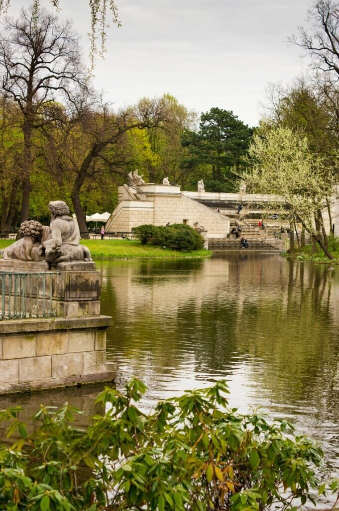
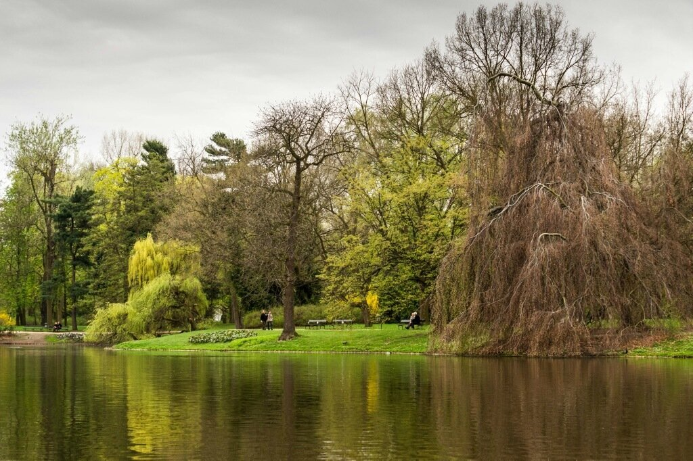
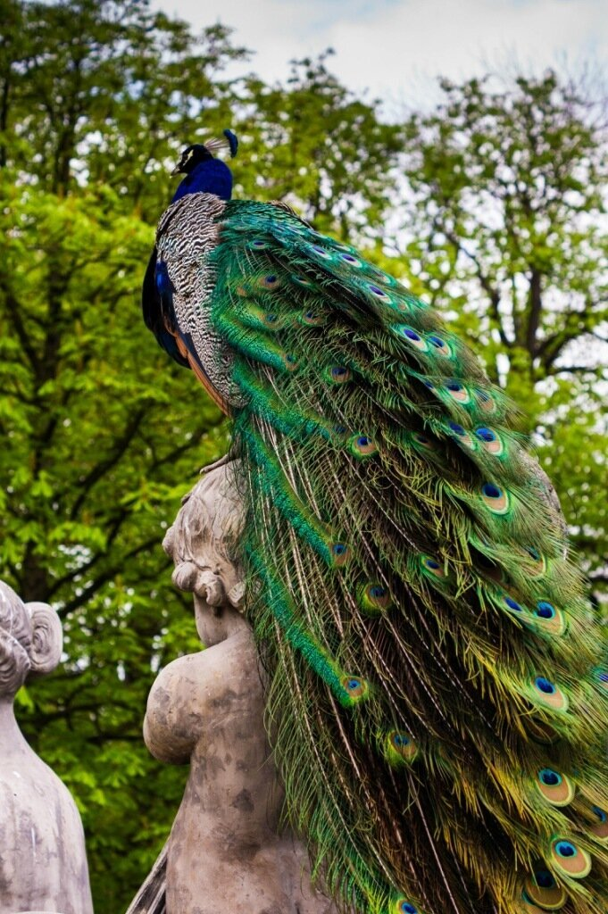
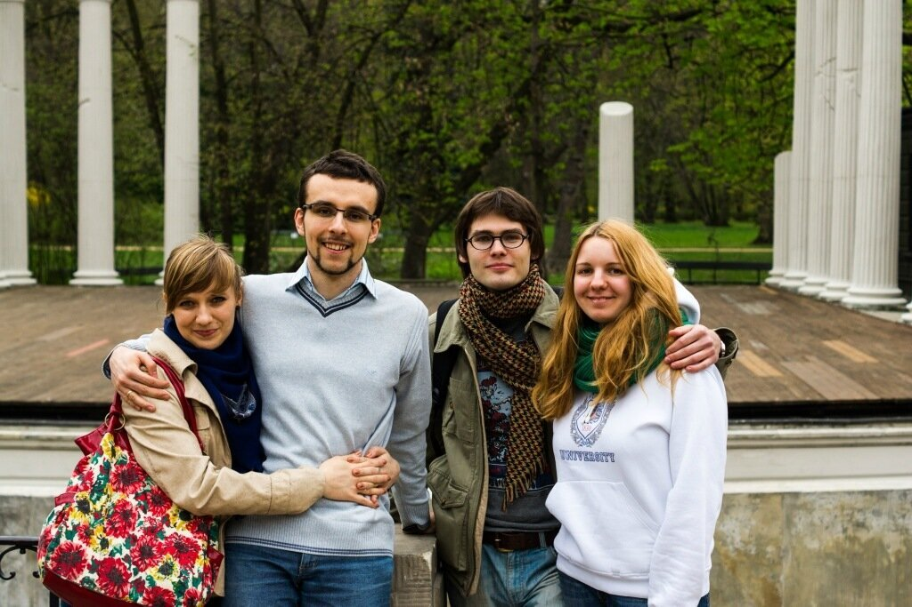
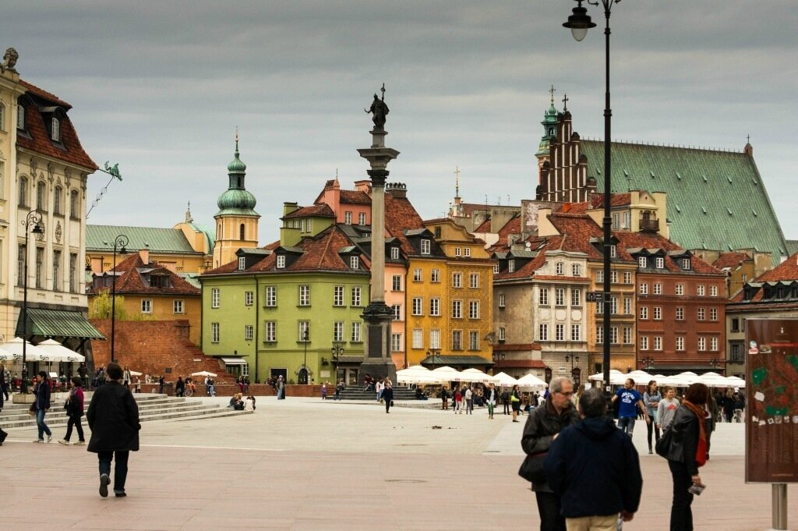
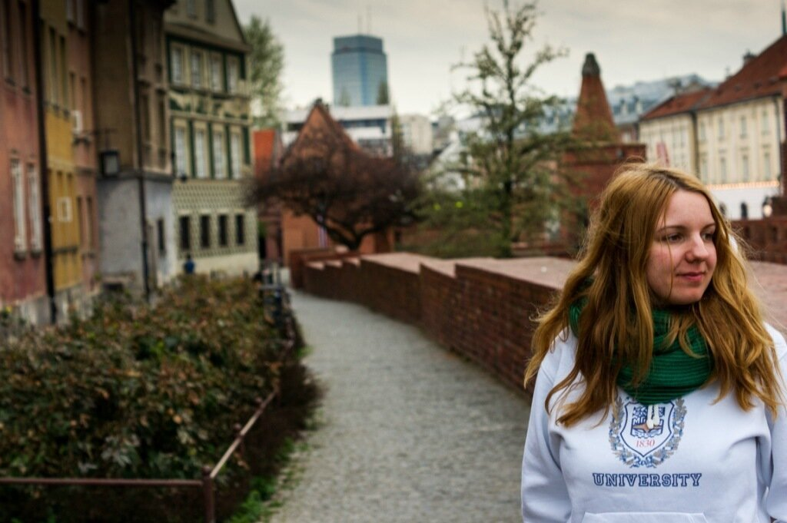
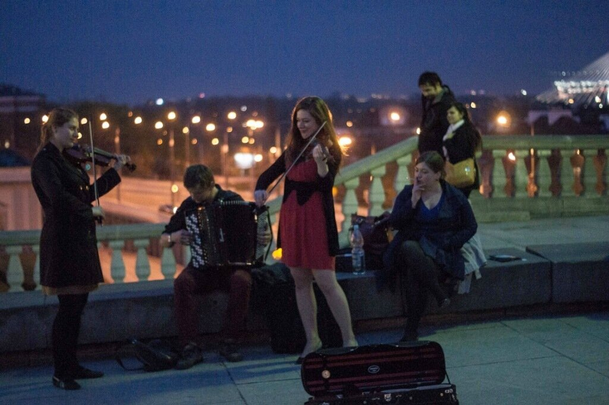

В прошлый раз я остановилась на встрече с Бартеком - нашим знакомым по предыдущей поездке в Польшу, Закопане. В тот раз нам помогло сблизиться вкусное горячее пиво, приготовленное Бартоломеем на кухне нашего хостела. На сей раз мы были приглашены на обед и единственным алкоголем на столе был домашний ликер.

<!--more--> Двумя автобусами из Hotel Aramis мы добрались до улицы Африканьска - по соседству значились еще Мексиканьска и прочие страноведческие названия. Как выяснилось позднее, это район посольств разных стран, и улица носит одноименное название. Билеты продавались вот в таких автоматах - очень удобно, что можно платить карточкой.

Мы познакомились с женой Бартека - симпатичной девушкой Иоанной, сокращенно Аша. Обменялись шутками "моя жена Саша-моя жена Аша" и незаметно для всех провели пару часов в уютной квартире. Нам показали свадебное видео. Оказывается, польская свадьба - это сочетание гражданской и церковной церемонии. Проводится в церкви и минимальное количество гостей около 80. У Аши и Бартека было 130 гостей! Мы до сих пор радуемся, что на нашей было всего 4 самых близких человека.. Ну да не об этом речь. Итак, закончив трапезничать, мы поехали сначала в парк Королевские Лазейки, а затем в исторический центр Варшавы. Парк необычайно красивый и тихий - в честь майских праздников жители Варшавы уехали за город, поэтому мы гуляли почти в гордом одиночестве.

Немного скульптуры

и природы

Парк так же знаменит павлинами - эти великолепные птицы разгуливают на расстоянии вытянутой руки.

Фото вчетвером на память

Исторический центр Варшавы прекрасен. 

Из рассказов Бартека мы узнали, что город был разрушен во время второй мировой войны, после чего был полностью восстановлен и внесен в список Всемирного наследия Юнеско (хотя кое-где еще идут реставрационные работы). При входе на площадь Старо Място стоит информационный плакат с фотографиями времен оккупации - от него действительно тогда остались одни руины. Поляки - молодцы! Вообще моя любовь к Польше трудно объяснима. Говорят, они нас не любят - но я никогда не ощущала плохого к себе отношения. Быть может, потому что я ездила только как турист. Быть может, нет. Но факт остается фактом - проехав почти всю Польшу на машине и побывав во всех ее концах, я чувствую себя здесь как дома..

Тем временем, я продолжаю свой рассказ. Мы остановились перекусить в заведении с национальной кухней, где Климентий сразу же заказал свое любимое польское блюдо - суп журек. Для тех, кто никогда не пробовал - похожий вкус можно воспроизвести добавлением сырка "дружба" в рассольник. И это только кажется, что вкусно не будет! А вот заказать горячее пиво в этом месте не получилось - ради этого мы спустя пару часов изучили все кафешки на туристических артериях города. Во время поисков услышали "Катюшу" в исполнении уличного ансамбля из двух скрипок и одного баяна.

Необычное сочетание. Играли очень хорошо, в том числе известные джазовые и рок композиции. В тот день мы вдоволь нагулялись, попробовали горячее пиво в нескольких местах, покатались на трамвайчке и даже сделали попытку лечь пораньше, чтобы бодро доехать до Вроцлава на следующее утро.
