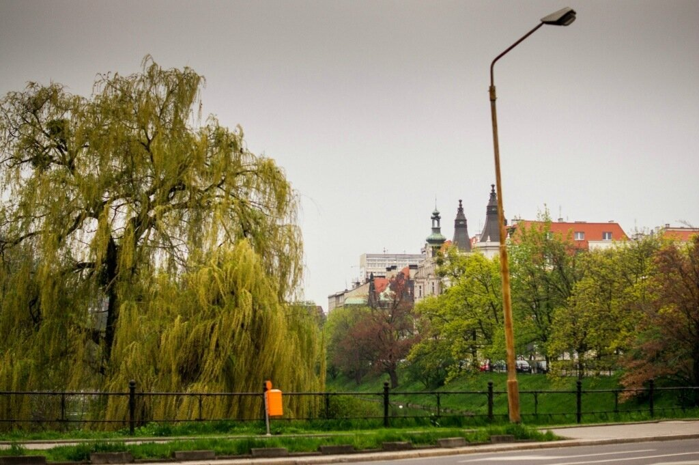
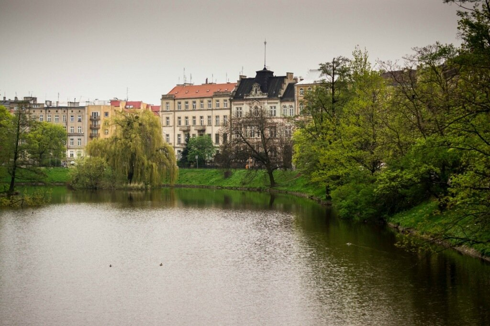
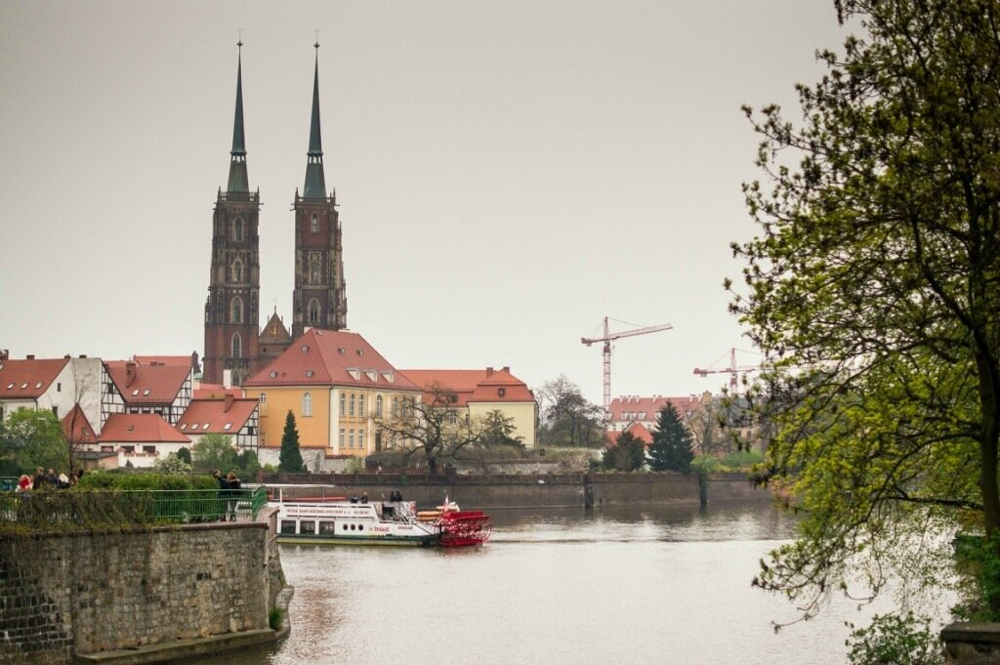
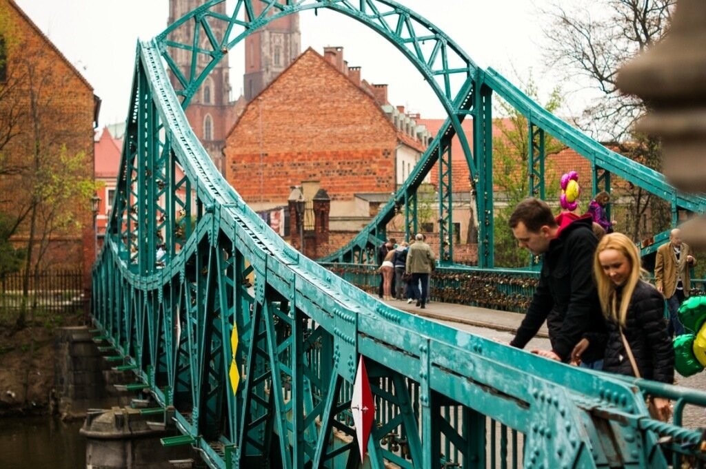
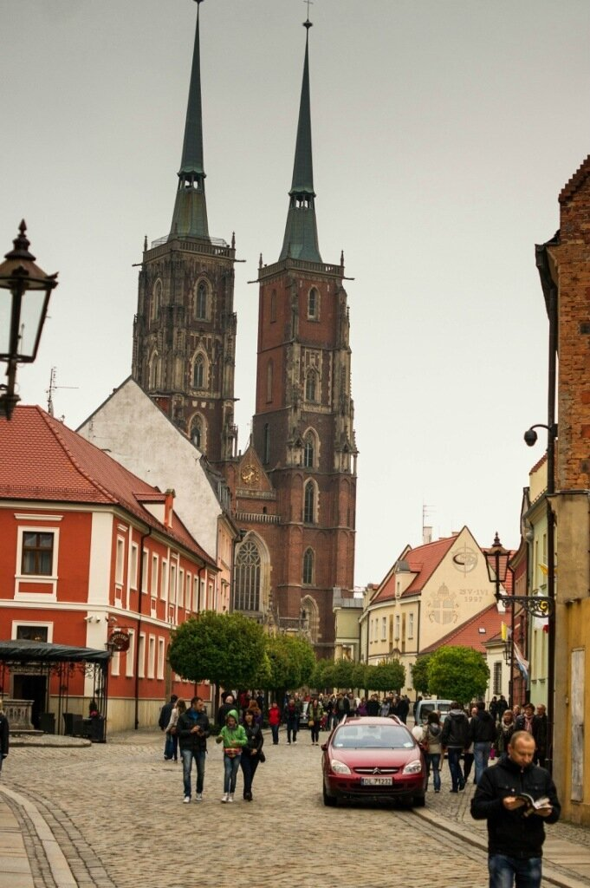
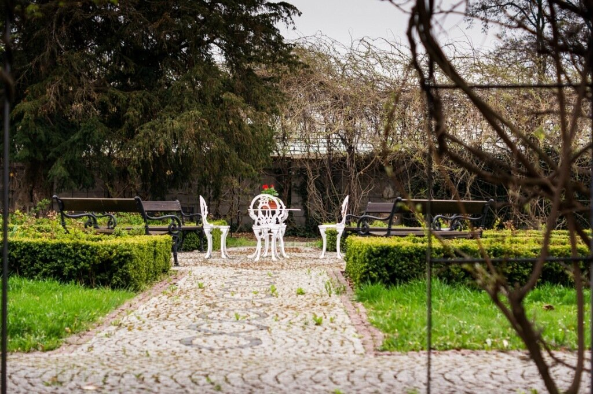
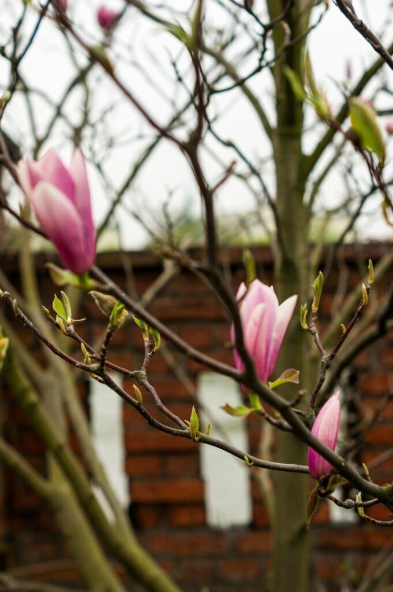
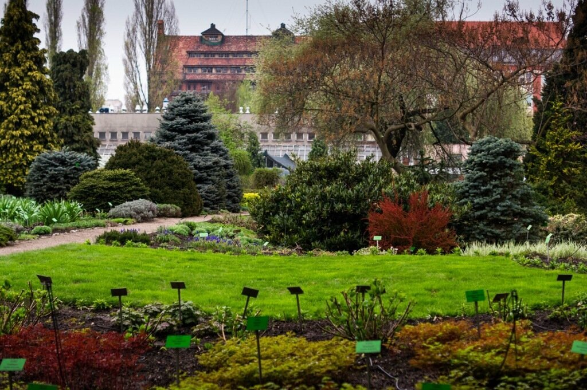

С утра позавтракали в Варшаве, что несколько затянуло наш выезд из столицы в сторону Вроцлава. Немного покружив по развязкам (без навигатора не справиться, честно скажу), мы наконец выехали на автобан. Основная его прелесть - он бесплатный (пока идут строительные работы) и абсолютно новый - никаких выбоин, асфальт идеально ровного цвета, с яркой разметкой. Вдоль автобана множество стоянок, на которых можно вкусно покушать и проверить почту по wi-fi. Лучше на моей памяти только автобан Австрии на участке Братислава-Вена. Тем временем мы добрались до Вроцлава и решили кинуть машинку недалеко от центра - нашли бесплатную парковку (Климентий - мастер!) и вынув из багажника самокаты, поехали уже на них изучать город.

<!--more-->Первые минут 10 ноги болят от брусчатки, а потом привыкаешь. Так как мы довольно внезапно решили заехать в этот город, про Вроцлав я знала лишь то, что он четвертый по величине город Польши и принимал Евро-2012. С первых же минут чувствуется атмосфера города - еще на подъезде мы уже как бы оказались в исторической части - в городе множество достопримечательностей и за день их все не охватить.

Основные памятники архитектуры и культуры сосредоточены на Тумском острове на реке Одра. Островом он был до 19 века, ныне это полуостров. Множество плакучих ив вокруг создают неповторимый уют.

Вид на Вроцлавский собор - первый готический собор Польши. 

Песчаный мост (Кафедральный) очень популярен среди местных - на нем навешаны замочки новобрачных, и туда-сюда ходят молодые мамы с колясками.

Кафедральный собор

По соседству с ним находятся апартаменты епископа и духовная семинария - для посетителей эти помещения закрыты, но весь остальной остров просто необходимо тщательно осмотреть. Например, за одной из арок скрывался потрясающий садик.

Находящийся на этом же острове Ботанический сад уже был закрыт, но мы смогли сфотографировать кусочек.

Вечером мы выбрались на центральную площадь, которая была "заполнена" туристами. Пишу в кавычках, ибо Вроцлав - очень недооцененный город для туристов - их откровенно мало, хотя пару-тройку русских в составе экскурсионных групп мы все-таки увидели. По духу Вроцлав во многом похож на Прагу, но куда более уютный и романтичный, подходящий для тихих прогулок вдвоем по пустынному парку, неспешным покупкам в hand-made лавках, катанию на кораблике по Одре. В такие города хочется вернуться, еще не уехав. И мы обязательно вернемся.
